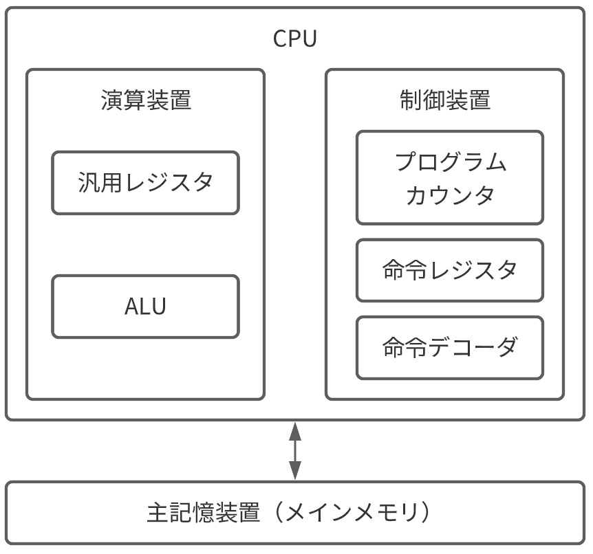
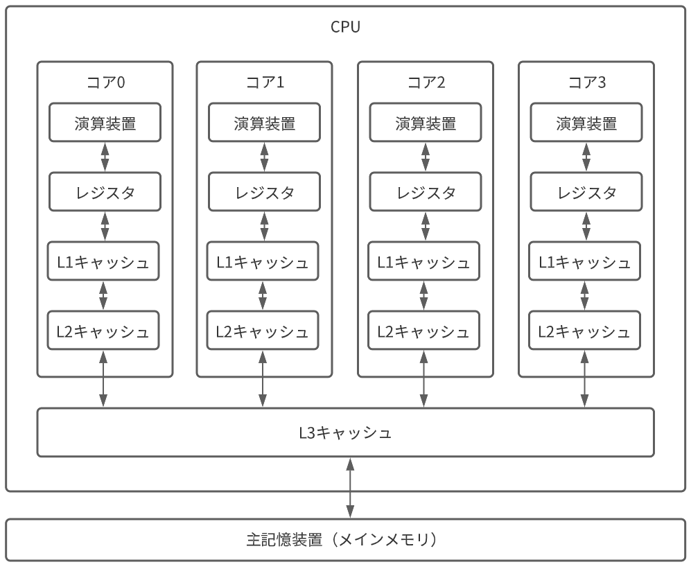
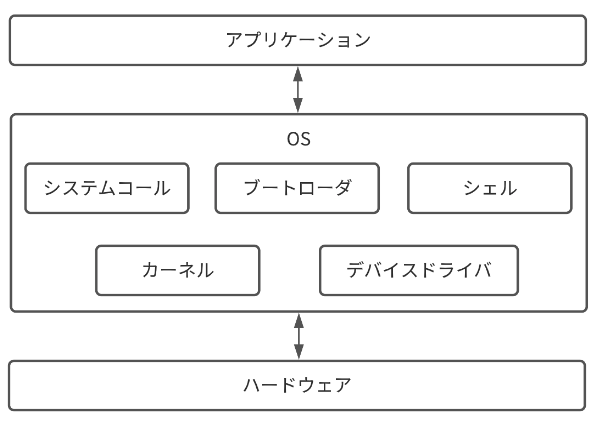

# OS

## OSの役割
- リソース管理
    - コンピュータには、CPU、メモリ、ストレージ、I/O デバイスといったリソースがあります。OS はそれらを効率よく安全に運用できるように制御します。主に、プロセス管理、メモリ管理、ファイルシステム管理、ストレージ管理、I/O システム管理があります。
- インターフェース(抽象化)
    - ユーザがコンピュータアーキテクチャを意識することなく操作できるような、インターフェースとしての役割があります。例えば、現在のこのページを開くとき、マウスを操作し、ボタンなどをクリックし、ネットワークから情報を取得しながら、同時にそれらの動作をモニターに映し出しています。

## CPU

- 命令レジスタ（instruction register）
    - 実行中の命令を格納するレジスタです。命令レジスタには、命令の種類を示すコード番号、対象のデータのメモリアドレスが入っているオペラント部が格納されます。

- 命令アドレスレジスタ（プログラムカウンタ）
    - 次に実行する命令のアドレスが格納されているレジスタです。

- 汎用レジスタ
    - 役割が割り当てられていない汎用的に利用できるレジスタです。

### キャッシュ

## OSの要素

- ブートローダ
    - コンピュータの電源投入後、OS を起動するためのプログラム
- カーネル
    - OSの中核となすプログラム。CPUの管理、メインメモリの管理、I/Oデバイス管理、ファイルシステム管理等
- システムコール
    - カーネルの操作に呼ばれる命令
        - ユーザーモード
            - ユーザーモードでは、アプリケーションやミドルウェアが実行できます。メモリや I/O デバイスにアクセス制限を設け、安全に処理可能かをチェックしてから、カーネルモードに切り替えることで実行します。
        - カーネルモード
            - カーネルモードは特権モードとも呼ばれ、アクセス制限なしでメモリや I/O デバイスを操作し、CPU の命令も全て実行することが可能です。
- シェル
    - OSの機能を使うためのソフトウェア

### プロセス
- プログラムのインスタンスのようなもので、実行中のプログラムのこと。プロセスを生成する際にメモリが割り当てられ、実行時は CPU、メモリ、ファイル、I/O デバイスなどのリソースを必要とする
- Linux では top コマンドによって、実行中のプロセスとリソースの使用率などの一覧を表示できます。各項目は下記のとおりです。
    - PID：プロセスに割り振られた ID です。 
    - PR：プロセスの優先度です。 
    - S：プロセスの状態です。
        - D：IO 完了待ちです。つまり、割り込み不能な待機状態のプロセスです。ユーザーが KILL することはできません。
        - R：実行状態または、実行可能な状態のプロセスです。CPU を実際に使用しているか、CPU の時間が割り当てられている状態です。
        - S：スリープ状態、つまり割り込み可能な待機状態のプロセスです。 
        - T：停止状態のプロセスです。 
        - Z：ゾンビ状態のプロセスです。プロセスの実行は完了していますが、親プロセスの確認がまだ済んでいない状態のプロセスのことを指します。

### マルチプロセスと割り込み
- マルチプロセス
    - 複数のプロセスを高速で切り替えることで同時に稼働しているように見せる
    - プロセススケジューラ
        - 適切にプロセスを処理する
    - 割り込み
        - プロセス外で起きたイベントを処理する仕組み
### スレッド
- スレッド（thread）は、専用のメモリ空間を持たずに親プロセスと共有します。また、スレッドは、スレッド ID、プログラムカウンタ、レジスタセット、スタックから構成される CPU 利用の基本単位です。プロセスは 1 つ以上のスレッドを持ちます。