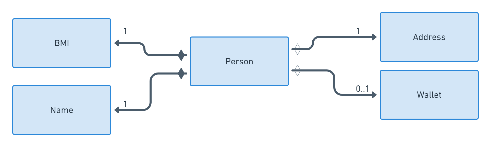
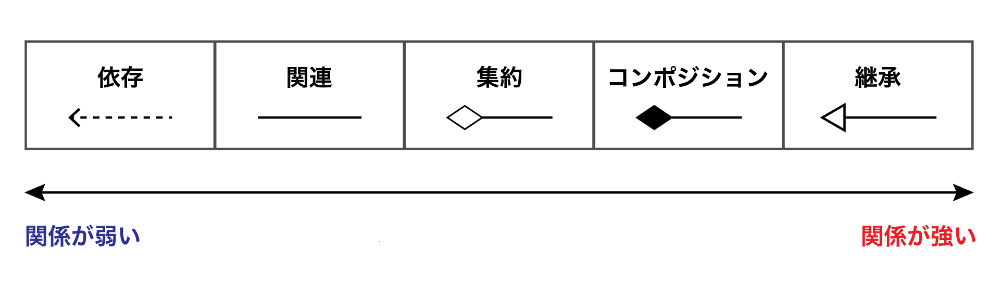
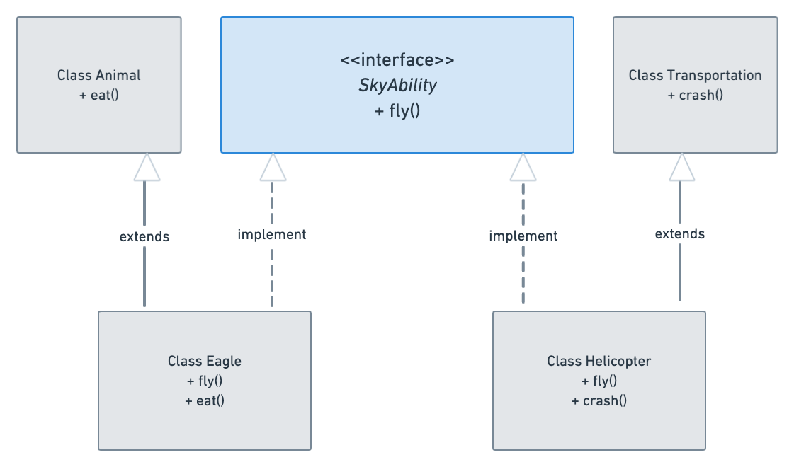
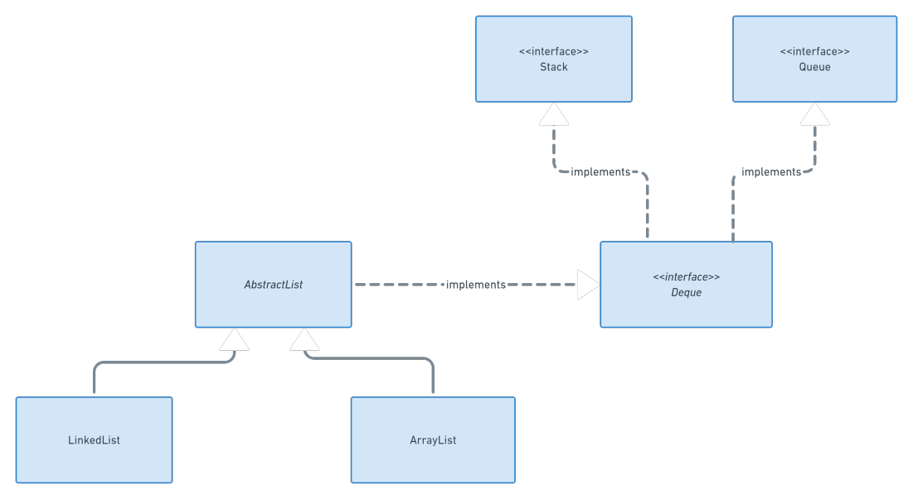

# オブジェクト指向設計
- プログラム全体がオブジェクトから構成されるプログラミングパラダイム。プログラム全体がオブジェクトだけで設計される
- オブジェクトが持つ状態と挙動のセットを定義し、設計図とインターフェースを使って抽象化し、オブジェクト間で状態と挙動のやり取りを行い、抽象化したものを再利用したり合成することで、コードの再利用性を高めることに焦点をあてている
- 手続き型プログラミングは、ステートメントやコードのブロック、データ構造、サブルーチンからの入出力の受け渡しでプログラミングを行う
- カプセル化、継承、ポリモーフィズムの３つの柱を構成する
  - クラスの抽象化、インターフェース、メソッドのオーバーロード、メソッドの上書き、動的バインディング、可視性修飾子、アップキャスト＆ダウンキャスト、不変性、ジェネリクスのような機能がある

## class設計
- すべてのデータ構造は設計図であるクラスを介して定義され、そのクラスのインスタンスをオブジェクトとよぶ
- オブジェクトを作成する行為をインスタンス化とよぶ
- オブジェクトの状態
  - オブジェクトに付随したデータ
  - メンバ変数：オブジェクト内部の変数、オブジェクトの状態を定義する
- オブジェクトの挙動
  - オブジェクトに付随した関数
  - オブジェクト内部の関数、オブジェクトの挙動を定義する
- オブジェクトのメンバ変数にアクセスすることで、オブジェクトの状態の読み書きができ、メソッドを介してオブジェクトの挙動にアクセスできる
- クラスはオブジェクトがどのようなメンバ変数とメソッドを持っているかを正確に指定し、オブジェクトの初期状態がどのように構築されるべきか(コンストラクタ)を定義する

## UML記法（Unified Modeling Language）
- スケッチ
  - 
- 設計図
- プログラミング言語

## リファクタリング
- クラス設計は常に開発者と他の開発者がそのクラスを使うことを念頭におくため、拡張性とリファクタリングを考える必要がある
- 拡張性
  - オブジェクトに新しい機能を追加する能力
- リファクタリング
  - クラスのユーザに影響を与えることなく、クラスの内部コードを修正したり変更したりする能力

## オブジェクトのスコープ
- スコープの優先順位
  1. メソッドローカルスコープ
  2. クラススコープ
  3. グローバルスコープ

## クラス変数
- 静的メンバ変数はクラス変数と呼ぶ
- 他のすべてのメンバ変数は、状態がメモリないで完全に分離されていて、オブジェクト内に含まれているため、インスタンス変数と呼ぶ

- クラス変数を変更すると、クラス内の全てのオブジェクトに影響を与えるため、constを使ってクラス変数を定数にする。大文字とアンダースコアで指定するのが一般的

## staticメソッド
- staticメソッドは、クラスのインスタンスを作成せずにメソッドを実行できる
- インスタンスメソッドとの唯一の違いは、インスタンスの状態にアクセスするためにthis参照がバインドされているか否か
- メンバ変数がすべてfinalで状態が存在しない場合、それはステートレスオブジェクトと呼ぶ
```php
// MathThingsの全てのメソッドはどの状態にも依存しません。これらのメソッドはMathThingsのインスタンスを作成することなく、いつでも自由に使うことができます。
class MathThings {
    // クラスメンバ定数を定義します
    public static final double PIAPPROX = 3.14159265359;

    // staticでアプリケーションが存続する限り、どこでもアクセスすることができます。
    public static double circleSurfaceArea (int x)  {
        return PIAPPROX * x * x;
    }

    public static double boxVolume(double x){
        return x*x*x;
    }
}

class Main{

    public static void main(String[] args){
        System.out.println("πは" + MathThings.PIAPPROX);

        System.out.println("1辺が2の立方体の体積は" + MathThings.boxVolume(2));
        System.out.println("半径4の円の面積は" + MathThings.circleSurfaceArea(4));

        System.out.println("1辺が5の立方体の体積は" + MathThings.boxVolume(5));
    }
}
```

## カプセル化
- クラスを設計する際、開発者に対して、どのような情報を公開するか、非公開にするかについて慎重に考える必要がある
- 状態と挙動をカプセルのような箱の中に封じ込め、公開非公開を定義することカプセル化と呼ぶ
- カプセル化によって、利用者がアクセスできるものを具体的に選択することができる、クラスがどのように使用されるかを定義し、強制することができる
- personクラスを定義する際、メンバ変数をすべて隠し、メソッドのいくつかも隠す、利用可能なものはtoString()関数とchangeName()関数だけ

- privateとpublicの可視性修飾子を付与する
- 定数のメンバ変数をのぞいて、すべてのメンバ変数をプライベートとして保持するのが一般的
- メンバ変数を読み込むには、アクセサメソッドと呼ばれるゲッターパブリックメソッドが使用される
  - ゲッターはメンバ変数のデータを取得して返す、getMyMemberVariable()のようにgetのあとにメンバ変数が続く
- メンバ変数を書き換えるには、ミューテータメソッドと呼ばれるセッターパブリックメソッドが使用される
  - セッターは入力を受け取り、いくつかの処理を行い、それに応じてメンバ変数を更新する、setMyMemberVariable()のようにメンバ変数がsetの後に続く
  - セッターメソッドを使うことで使用と実装を分離し、他の利用者にメンバ変数のデータを更新させずに、セッターに追加のロジックやプロセスを追加できる。また、入力を検証したり、デバッグ/ログを配置、入力データをワープする追加の処理を追加することができる

```php
import java.util.Calendar;

class Person{
    private String firstName;
    private String lastName;
    private double heightM;
    private double weightKg;
    private int birthYear;

    public Person(String firstName, String lastName, double heightM, double weightKg, int birthYear){
        this.firstName = firstName;
        this.lastName = lastName;
        this.heightM = heightM;
        this.weightKg = weightKg;
        this.birthYear = birthYear;
    }

    // getter/setterの始まり
    public String getFirstName(){
        return this.firstName;
    }

    public void setFirstName(String firstName){
        this.firstName = firstName;
    }

    public String getLastName(){
        return this.lastName;
    }

    public void setLastName(String lastName){
        this.lastName = lastName;
    }

    public double getHeightM(){
        return this.heightM;
    }

    public void setHeightM(double heightM){
        this.heightM = heightM;
    }

    public double getWeightKg(){
        return this.weightKg;
    }

    public void setWeightKg(double weightKg){
        this.weightKg = weightKg;
    }

    public int getBirthYear(){
        return this.birthYear;
    }

    // getter/setterの終わり

    public String toString(){
        return this.getFullName() + ", heightM: " + this.heightM + ", weightKg: " + this.weightKg + ", age: " + this.getAge();
    }

    private String getFullName(){
        return this.firstName + " " + this.lastName;
    }

    public int getAge(){
        int currentYear = Calendar.getInstance().get(Calendar.YEAR);
        return currentYear - this.birthYear;
    }
}

class Main{
    public static void main(String[] args){
        Person carly = new Person("Carly", "Angelo", 1.72, 85.5, 1996);

        System.out.println(carly);
        System.out.println(carly.getAge());

        carly.setFirstName("Carly II");
        carly.setLastName("Bardernson");
        System.out.println();
        System.out.println(carly);

        System.out.println();
        System.out.println("Weight:" + carly.getWeightKg());
        System.out.println("Height:" + carly.getHeightM());
        System.out.println("Birth:" + carly.getBirthYear());

        // ERROR 
        // carly.lastName = "Bardernson";
        // carly.birthYear = 1976;
        // System.out.println(carly.firstName);
    }
}
```

## クラスの抽象化
- 関数の抽象化
  - 関数をブラックボックスとして扱う場合、どのような処理なのか、入力は何か、出力は何かの３点を抑えると良い
- クラスを扱う際は、クラスの利用者はクラスの契約以外を除く全ての情報が非表示にされていることが理想。クラスの利用者は、クラスの説明、利用可能なpublicコンストラクタ、メソッド、変数、そしてpublicメンバがどのように振る舞うかのみ知っていれば良い
- publicメソッドは関数の抽象化を通して記述することもできる
- クラスの実装とクラスの使用方法を分離することができ、クラス契約はクラスがどのように使用されるかを示し、カプセル化は内部実装と契約で利用可能なものを強制する
- クラス契約
  - クラスの全てのpublicメンバ変数とメソッドにそって、クラスの機能や動作、使用法について、開発者と利用者の間で合意することを指し、多くの場合、記述形式が用いられる
  - 記述はコード内のコメントやAPIのドキュメントの場合もある
- クラスの抽象化は可読性、保守性、ユーザビリティを向上させることができる

# 関係と継承
- クラスとオブジェクトの関係性
- 関連(association)、集約(aggregation)、コンポジション、継承(inheritance)

## 関連
- 関連(association)とは、２つの異なるクラス間における二項関係のことを指す
- 双方向性
  - 両方のクラスがお互いにアクセス権をもつ
  - 従業員が勤務先の会社の全てのpublic変数とメソッドにアクセスでき、逆に会社は従業員のpublic変数とメソッドにアクセスできるような状況を指す
- 単方向性
  - 一方のクラスだけが他方のクラスへのアクセス権をもつ
  - 財布を所有するperson、personだけが財布のpublic変数とメソッドにアクセス可能で、財布はpersonへのアクセスがきない等

  
## 多重度
- 多重度(multiplicity)とは、関係に関与するオブジェクトの数を表す変数のことを指す
- [*]は、関係ないにあるオブジェクトの数だけ存在する可能性があることを意味する
- 定数nとmを用いて、m..nとすることで、m-nのオブジェクトが関係内に存在することを示す

```php 
class Employee {
    private Company mainJob;
    private Company secondJob;
    //......
}

// 企業は、できるだけ多くの従業員の雇用が可能です。
// 会社は1 - 10名の役員で運営されています。
// 会社は多くの子会社を所有することがあります。
// 会社は親会社に属すことも、そうでないこともあります。
class Company {
    private ArrayList<Employee> employees;
    private BoardMember[] boardMembers = new BoardMember[10];

    // 親会社はnullの可能性があることに注意してください。
    private Company parentCompany;
    private ArrayList<Company> subsidiaries;
    //......
}

// 役員は1 - 5社の会社を管理します。
class BoardMember {
    private Company[] companiesManaging = new Company[5];
}

class Main{
    public static void main(String[] args){
    }
} 
```

## 集約とコンポジション
- クラス間の関係は、所有者とそれらの所有者の寿命を決定することで、さらに詳しく説明することができる
- 集約(aggregation)とは、クラスAが状態の一部としてクラスBを含む関連のことを指す。クラスAはクラスBの所有者になる。クラスAは集約する側であるのに対し、Bは集約される側になる
  - 集約と通してインスタンスの寿命についての情報を得ることはできない、あるオブジェクトAがメモリから削除された場合、BもAにそって削除されるのか、それともメモリ内で生き続けるのかという区別を明確にしない
- コンポジション(composition)とは集約先のオブジェクトが集約元のオブジェクトに依存している特殊な種類の集約になる
  - コンポジションにおいて、所有者は完全に支配権を持っているので、集約先のオブジェクトはそれ自体で存在することはできない
  - クラスAとクラスBにコンポジションが適用されている場合、クラスAがBの所有者であり、オブジェクトAが死ぬと、オブジェクトBも死んでしまう
- UML図では、集約は、集合元である所有者クラスのすぐ横に、空のダイヤモンドでマークされ、コンポジションは塗りつぶされたダイヤモンドでマークされる


## 依存関係
- 関連、集約、コンポジションは２つのオブジェクト間のある強い関係を定義
- 関係の弱い形は依存関係と呼ばれる
- クラスAが何らかの方法でクラスBに依存しており、クラスBの状態の変化がAに影響を与える可能性があることを意味する、関連も強い依存関係といえる
- AがクラスBを所有している場合、AはクラスBに依存関係を持っている。クラスの状態の一部としてメンバ変数を持っている場合、常に依存関係が存在する
- 開発者はクラスがもっている依存関係を認識しておく必要がある

- 入力として依存関係を宣言することもできる。依存性注入(dependency injectio)と呼ばれ、関数が内部でクラスのオブジェクトを作成することによってクラスを使用するのではなく、全ての依存関係が関数に渡される
  - 依存性注入では、外部のユーザがクラスの依存関係が何であるかを知ることができない
  - メソッドは明示的にオブジェクトを取り込むので、開発者は依存関係を把握することができる

## 継承
- 一方のクラスが他方のクラスの既存の定義を使用して自分自身を定義できるようにする、２つのクラス間の関係のことを指す。継承を使うことによって以前作成した他のクラスを再利用して新しいクラスを作成することができる
- データ構造の一般化を行い、ほとんどの場合は、is-a関係に従う。階層構造にそって、親が存在し、子は親から全てものを継承し、さらに子クラスが定義したい状態や動作を追加で継承する
- まずスーパクラスと呼ばれる一般的なクラスを定義し、それをサブクラスと呼ばれるより専門的なクラスに拡張する
- protected可視性修飾子は、クラスを継承する他のクラスをのぞいて、全てのメンバ変数を内部として非表示にする。全てのサブクラスは親のprotectedメンバ変数にアクセスできる

## ポリモーフィズム
- サブクラスがスーパークラスの全てのメソッドと変数を持つことが保証されてる
- スーパークラスのオブジェクトが必要とされ、サブクラスが使用される場合、ポリモーフィズムになる、ポリモーフィズムとは、文字通り、スーパークラスの形で、あるオブジェクトが別のオブジェクトの形をとる能力を指す

# 抽象クラス、インターフェース、ジェネリクス
- 抽象化を作成し、クラスが持つべきメソッドのセットを定義することが目標
- 抽象化とはUML図をかいているようなものなので、コードで実装する必要はなく、設計の柔軟性を高め、抽象型を作成することができる

## 抽象クラス(abstract -> extends)
- ツリーの一番上は汎用的なクラスである A があり、スーパークラスを継承するサブクラスAを拡張し、Aのデータ構造である具象クラスとなる
- 葉ノードから根ノードに向かって上に行くほど、クラスのクラスや記述はより一般化され、抽象化されていく
- 状態と動作を定義するインスタンス化できないクラスであり、それらを実装する場合としない場合がある。抽象メソッドとは、抽象クラスのメソッドのうち、実装されていないものを指す
- 抽象クラスのルール
  - クラスが少なくとも 1 つの抽象メソッドを持っている場合、それは定義上、抽象クラスであり、Java のような特定の言語では、抽象クラスとして宣言する必要がある
  - 抽象クラスはインスタンス化することができない。したがって、まず、抽象クラスから拡張し、全ての抽象メソッドを実装した具象クラスを定義する必要がある
  - 抽象クラスの状態を定義し、デフォルト値を割り当てることもできる。また、状態を初期化するコンストラクタを定義することもでき、サブクラスはこの（スーパークラスの）コンストラクタを呼び出すことができる。サブクラスがアクセスできるように、これらの状態を protected に設定することをお勧める
  - 言語によっては、抽象メソッドを使わずに抽象クラスを定義できる場合がある。そのような場合は、クラスは継承されなければならないことが明確になっている
  - サブクラスは全ての抽象メソッドを実装する必要がある。全てのメソッドを実装していない場合は、サブクラス自体も抽象クラスになる
  - 具象クラスを継承するサブクラスを作成し、その中に抽象メソッドを定義するか、親クラスのメソッドを抽象メソッドとして上書きすることで、サブクラスを抽象クラスにすることができる（すなわち、Java では、抽象クラスを含めて、全てのオブジェクトは concrete Object クラスを継承する）

## インターフェース(interface -> implements)
- オブジェクトが実装しなければならない挙動のセットを定義する、インターフェースには、インターフェースを実装するクラスの抽象メソッドのみが含まれる
- インターフェースを使用する理由は、データ型をデータ構造によってではなく、オブジェクトが持つ利用可能な挙動によって宣言を行うため
- インターフェースは、継承やコンポジションとは異なり、密接な関係を持たずに挙動を指定するために使用される。インターフェースはクラスが持つべき共通の挙動は定義するが、クラスの何かを共有するという要件は存在しない。クラスが持たなければならないのは、インターフェースで定義された挙動のみ

- コンポジションは通常 has-a の関係（Person は、BMI と name を持っている）、継承は is-a の関係（Fox は Mammal、Mammal は Animal である）、インターフェースは、契約ベースの関係（Helicopter と Eagles は共に Fly を実装しているので、飛ばなければならない）に従う
- インターフェースについての重要な点
  - インターフェースは挙動を指定するだけで、状態を指定することはできない
  - インターフェースによって指定される挙動は抽象メソッド。インターフェースを実装するクラスが定義、実装しなければならない関数名として扱う。インターフェースは抽象メソッドだけで構成されている
  - インターフェースには抽象メソッドしか許されていないので、抽象クラスとは大きく異なる。抽象クラスでは、状態を指定し、メソッドを実装し、抽象メソッドを持つことができる
  - クラスが実装できるインターフェースの数に制限はない。例えば、Car は、Audible、Drivable、Vehicle、Product を実装することができる
- 継承は１つのクラスのみに制限されるが、インターフェースはオブジェクトがx,y,zの挙動を実装しているかどうかをコンパイラにチェックさせるための契約。インターフェースは実際には挙動の処理を実装しないので、単純なチェックで十分になる
  - オブジェクトが２つ以上のインターフェースを実装していて、少なくとも２つのインターフェースがxの挙動を必要としている場合、競合はなく、むしろ要件が満たされていることになる


## ジェネリクス
- クラスは汎用的なデータ型を変数や入力として宣言することができるようになり、オブジェクトが特定のクラスの下でインスタンス化される際に、エラー検出のためのコンパイル時の構文チェックが行われる
- 


