# ソフトウェア開発・デザインパターン
- オブジェクト指向によるソフトウェア開発を行う場合、コードのリファクタリングを最小限に抑えるため、将来起こりうる仕様変更を考慮しながら、再利用可能なソフトウェアを設計するのが理想的
- 低結合、高凝集のシステムの実装、可能な限りシンプルかつ、将来の仕様変更に対して十分な余地を残しておく必要がある
- 再利用性
  - 全く同じコードを異なる状況下で再利用するという点で、コードがどれだけ汎用性を持つかを意味し、コードの再利用がどれだけ簡単で、どれだけ多くのシナリオをカバーできるかによって計測される
  - 再利用性が高ければ高いほど、その設計は優れている
- リファクタリング
  - 外部契約のプロパティを全て維持したまま、内部的にコードを編集するプロセスのこと。リファクタリングされたコードは他のソフトウェアに一切の影響を与えないことが理想的とされており、設計のリファクタリングが簡単であればあるほど、良いコード
- 結合度
  - あるモジュールが他のモジュールとどれだけ絡み合っているかを意味する。高結合とは、２つのモジュールが絡み合っており、お互いに依存していることを意味し、低結合とは、２つのモジュールがそれほど絡み合っておらず、お互いにほとんど依存していないことを意味する
- 凝集度
  - 構造体やモジュールの要素が、一つのタスクを達成するためにどれだけうまく連携しているかを意味する
  - 構造の内部の要素がどれだけ連携して、１つのことを正確にこなすことができるかを表す。高凝集とは、構造体の全ての要素がうまく連携し、単一の最終目標を達成することに集中していることを意味し、低凝集とは、構造体の要素が集中しておらず、あまりにも多くの無関係なタスクや最終目標を行っていることを意味する
- 複雑度
  - 設計のコードベースがどれだけ複雑かどうかを指す。複雑度が大きいほど、ソフトウェアのデバッグ、テスト、拡張、保守が非常に困難になる一方、複雑度が小さいと、よりシンプルで優れた設計になる
- デザインパターンとは、洗練されたソフトウェアシステムに頻繁に登場する設計を集約したもの。十分にテストされ、文章化され、言語に組み込まれているパターンも存在する。デザインパターンは、全てのOOPフレームワークに共通して使われている

# インスタンス化(Creational Pattern)
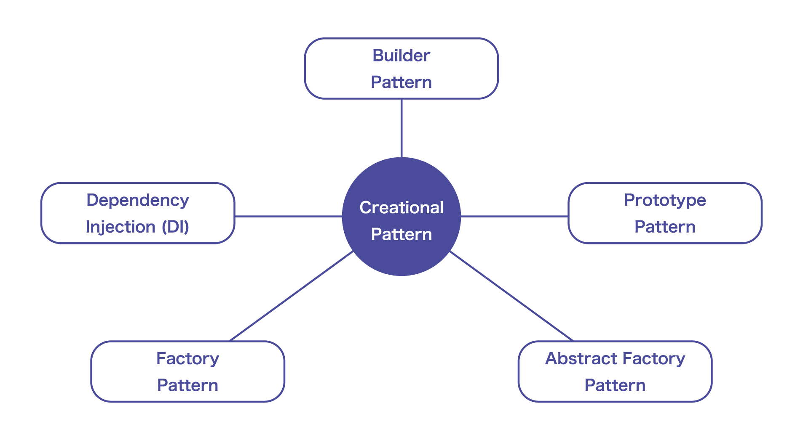
- 関心の分離という考え方に基づく。オブジェクトを構築したり、取得したりするだけでもかなりの労力がかかり、それ自体が面倒なタスクになってしまうことがある
- オブジェクト作成が、単にnewキーワードを使うように簡単ではない場合、その作業を他のタスクから切り離すことを考える

## 依存性の注入
- 依存関係を持つオブジェクトを入力として宣言し、受け渡しができるようにする
- 依存関係が入力パラメータとして指定されている場合は、外から把握することができる  

悪い例
```php
class Example{
    // このメソッドは、パラメータを渡してオブジェクトを作成します。本体内部で作成されたオブジェクトは入力に依存していますが、依存性は指定されていません。つまり、外部からは、calculateBMI内でどのクラスがオブジェクトを作成しているのか正確には把握することはできません。
    public static double calculateBMI(String firstName, String lastName, int age, double heightM, double weightKg, String biologicalSex){
        Person person = new Person(firstName, lastName, age, heightM, weightKg, biologicalSex);
        return person.getWeightKg()/(person.getHeightM()*person.getHeightM());
    }
}

class Main{
    public static void main(String[] args){
        System.out.println(Example.calculateBMI("Thomas", "Danny", 23, 1.5, 65, "male"));
    }
}
```
依存関係を入力として宣言することで、依存していることを把握することが可能
```php
class Example{
    // 依存関係は入力として宣言されています。したがって、外からこの関数がPersonクラスとそのインスタンスに依存していることを把握することができます。
    public static double calculateBMI(Person obj){
        return obj.getWeightKg()/(obj.getHeightM()*obj.getHeightM());
    }
}

class Main{
    public static void main(String[] args){
        // オブジェクトを作成するのは呼び出し元の仕事です。実際のシステムでは、このプロセスはすでに組み込まれている可能性があることに注意してください。これは動的でテスト可能なものになります。
        System.out.println(Example.calculateBMI(new Person("Thomas", "Danny", 23, 1.5, 65, "male")));
    }
}
```
上記のようにすることで、依存関係の書き換えも可能になる（personではなくanimalのBMIを計算する等)
また、ポリモーフィズムを利用して、BMIインターフェースを実装したオブジェクトを受け取ることもできる。呼び出し元がBMIを実装しているオブジェクトを作成するかぎり、どんなMBIオブジェクトでも受け取れるようになり、コードは問題なく動く
```php 
class Person implements BMIObject{
    private String firstName;
    private String lastName;
    private int age;
    private double heightM;
    private double weightKg;
    private String biologicalSex;

    public Person(String firstName, String lastName, int age, double heightM, double weightKg, String biologicalSex){
        this.firstName = firstName;
        this.lastName = lastName;
        this.age = age;
        this.heightM = heightM;
        this.weightKg = weightKg;
        this.biologicalSex = biologicalSex;
    }

    public double getHeightM(){
        return this.heightM;
    }

    public double getWeightKg(){
        return this.weightKg;
    }

    public String getName(){
        return this.firstName + " " + this.lastName;
    }

    public String toString(){
        return this.getName();
    }
}

class Animal implements BMIObject{
    protected String species;
    protected double heightM;
    protected double weightKg;
    protected double lifeSpanDays;
    protected String biologicalSex;
    protected Date spawnTime;
    protected Date deathTime;
    protected int hungerPercent = 100;
    protected int sleepPercent = 100;

    public Animal(String species, double heightM, double weightKg, double lifeSpanDays, String biologicalSex){
        this.species = species;
        this.heightM = heightM;
        this.weightKg = weightKg;
        this.lifeSpanDays = lifeSpanDays;
        this.biologicalSex = biologicalSex;
        this.spawnTime = new java.util.Date();
    }

    public void eat(){
        if(!this.isAlive()) return;
        this.hungerPercent = 0;
    }

    public void setAsHungry(){
        if(!this.isAlive()) return;
        this.hungerPercent = 100;
    }

    public boolean isHungry(){
        return this.hungerPercent >= 70;
    }

    public void sleep(){
        if(!this.isAlive()) return;
        this.sleepPercent = 0;
    }

    public void setAsSleepy(){
        if(!this.isAlive()) return;
        this.sleepPercent = 100;
    }

    public boolean isSleepy(){
        return this.sleepPercent >= 70;
    }

    public void die(){
        this.sleepPercent = 0;
        this.hungerPercent = 0;
        this.deathTime = new java.util.Date();
    }

    public boolean isAlive(){
        return this.deathTime == null;
    }

    public String toString(){
        return this.species + " lives " + this.lifeSpanDays + " days/" + "gender:" + this.biologicalSex + "." + this.status();
    }

    public String status(){
        return this.species + " status:" + " Hunger - " + this.hungerPercent + "%, " + "sleepiness:"+this.sleepPercent + "%" + ", Alive - " + this.isAlive() + ". First created at " + this.dateCreated();
    }

    public String dateCreated(){
        return new SimpleDateFormat("MM/dd/yyyy HH:mm:ss").format(this.spawnTime);
    }

    public double getHeightM(){
        return this.heightM;
    }

    public double getWeightKg(){
        return this.weightKg;
    }
}

interface BMIObject{
    abstract double getHeightM();
    abstract double getWeightKg();
}

class Example{
    // 依存関係はBMIObjectに変更されました。
    public static double calculateBMI(BMIObject obj){
        return obj.getWeightKg()/(obj.getHeightM()*obj.getHeightM());
    }
}

class Main{
    public static void main(String[] args){
        System.out.println(Example.calculateBMI(new Person("Thomas", "Danny", 23, 1.5, 65, "male")));
        System.out.println(Example.calculateBMI(new Animal("Cat", 0.23, 5.2, 4500, "female")));
    }
}
```
依存性の注入によって、ユニットテストでどのようなデータを通過させ、何を重点的にテストすべきか把握できるので、モジュールや個々の関数のテストははるかに楽になる

### 制御の反転(inversion of control, IoC)
- ユーザーが従わなければならないガイドラインが既に用意されている
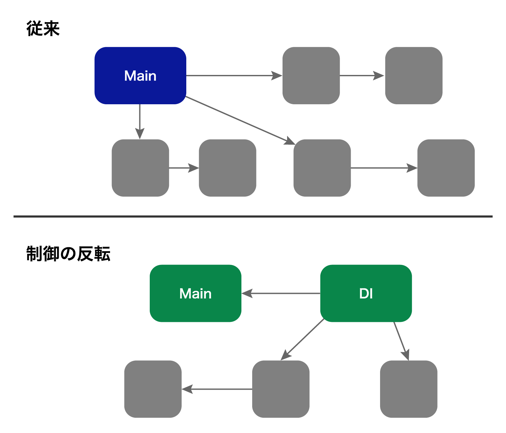

### DIコンテナ
- インスタンスの生成に必要なオブジェクトと関数を含むコンテナで、システム内でそれらに依存するメソッドに渡すために使われる
- メソッドが呼び出されると、システムは依存関係や呼び出しの箇所、キーなどの情報を把握することができるため、正しいオブジェクトがコンテナから取得され、システムが呼び出す関数に渡される
- フレームワークやシステムによって、サービスロケータが提供されることもある、これらのロケータはレジストリをもち、メソッドが必要とする依存関係を正確に判断したり調べたりすることができる
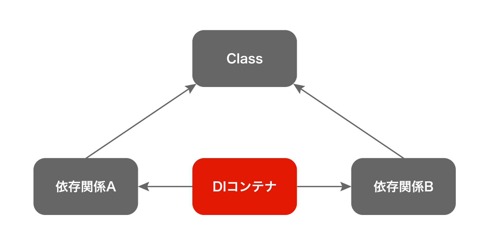

- BクラスのオブジェクトをAクラスの依存関係として扱わなくても良いケース
  - メソッド自体がメインシステムの場合
    - メインシステムの仕事は、他のメソッドが使用するオブジェクトを作成すること
  - AとBのオブジェクトが両方とも同じクラスのものである場合（A=B）
  - クラスAとクラスBの両方が同じエコシステムの一部である場合
    - 両方とも全く同じモジュール下にある可能性がある。設計上、モジュールの内部を外から見えないようにしていることもある。モジュールからの全てのオブジェクトは制御されているため、相互に接続され、お互いに依存していることは問題にならない

## Factory Method
- オブジェクトO作成することを目的としたインターフェースEで定義されたメソッドで、クライアントはこのメソッドを呼び出してOオブジェクトを作成する
- Eのサブクラスは、異なる種類のOオブジェクトやOのサブクラスのオブジェクトを生成するためにFactory Methodを再定義することができる
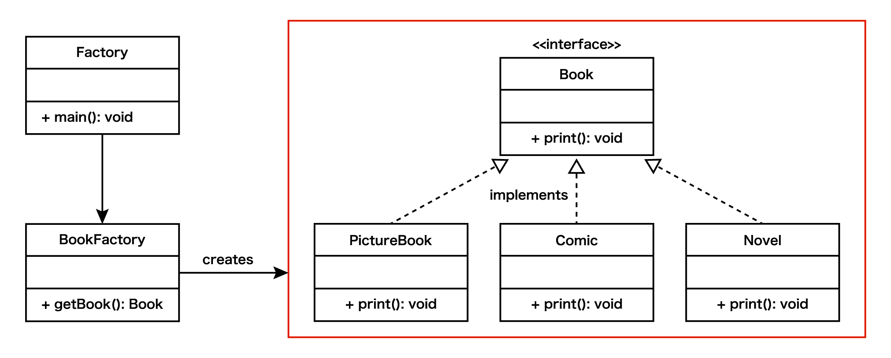
- Factory Methodを使うと、特定のオブジェクトを作成する責任をサブクラスに委ねることができる
- 元のクラスが提供する他の全ての機能は、通常通りに動作し、サブクラス間の唯一の違いは、各サブクラスがFactory Methodを実装したり、上書きしたりすることで、結果的に異なるオブジェクトが使用される
[Factoryについて](https://techracho.bpsinc.jp/hachi8833/2020_12_03/46064)
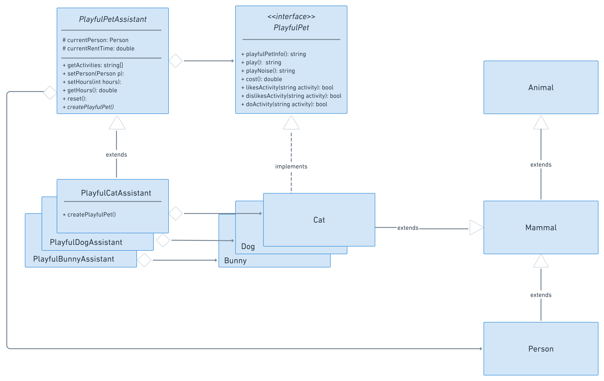
- Factory Methodでオブジェクトを作成するクラスはCreatorと呼ばれる
- CreatorはProductと呼ばれるオブジェクトを作成する
- CreatorはCreatorA、CreatorB、CreatorC,,,と拡張して、ProductA、ProductB、ProductC,,,を作成することができる
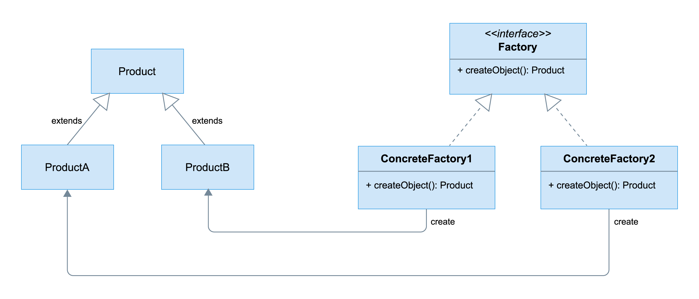
- FactoryMethodは再利用可能で、単一責任則を持っているが、Creatorのために多くのサブクラスをもたなければならないことに注意
- Creatorインターフェースがサブクラスの実装に必要な抽象メソッドを追加するたびに、全てのサブクラスが独自の実装を定義する必要がある

## Abstract Factory
- 関連するオブジェクトのセットを作成することができるインターフェースのこと
- Abstract Factoryはサブクラスの全てのFamilyを構成する
- システムが関連するオブジェクトのセットを作成し、他のロジックからそれらがどのように作成、構成されるかを分離したい場合に役に立つ
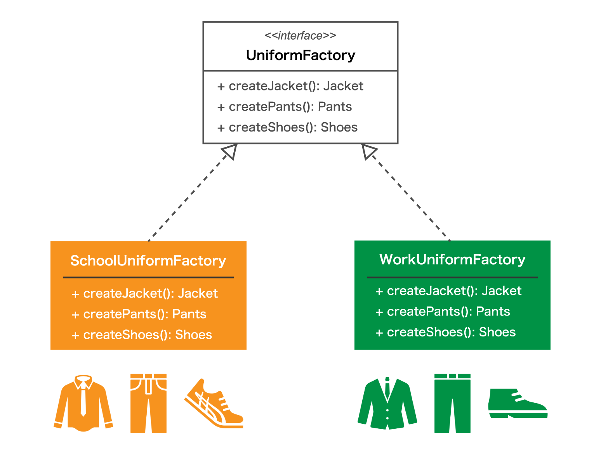
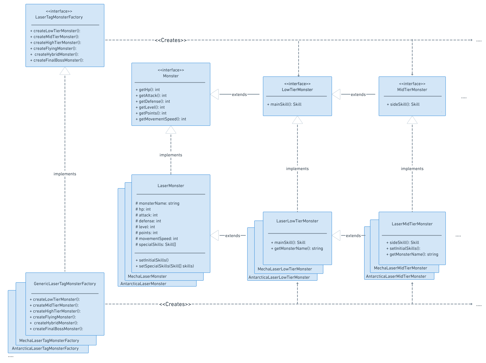
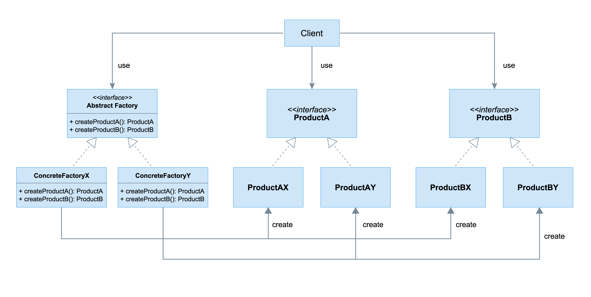
- Abstract FactoryはFamiilyとして一緒に使われることを意図されているため、Familyの構成要素を事前に知っておくことが理想となる
- 別のメソッド関数が必要になる場合、新しいオブジェクトをサポートする複数のFamilyを全て更新する必要がある
```java
import java.util.Arrays;
import java.util.Random;

class RandomWrapper{
    public static int getRan(int min, int max){
        return min + (int)(Math.random() * ((max - min) + 1));
    }

    public static boolean ranBoolean(){
        return new Random().nextBoolean();
    }
}

class Person{
    private String firstName;
    private String lastName;
    private int age;
    private double heightM;
    private double weightKg;
    private String biologicalSex;

    public Person(String firstName, String lastName, int age, double heightM, double weightKg, String biologicalSex){
        this.firstName = firstName;
        this.lastName = lastName;
        this.age = age;
        this.heightM = heightM;
        this.weightKg = weightKg;
        this.biologicalSex = biologicalSex;
    }

    public String getName(){
        return this.firstName + " " + this.lastName;
    }

    public String toString(){
        return this.getName();
    }
}

interface LaserTagMonsterFactory{
    abstract public LowTierMonster createLowTierMonster();
    abstract public MidTierMonster createMidTierMonster();
    abstract public HighTierMonster createHighTierMonster();
    abstract public FlyingMonster createFlyingMonster();
    abstract public HybridMonster createHybridMonster();
    abstract public FinalBossMonster createFinalBossMonster();
}

class Skill{
    protected int damage;
    protected String description;

    public Skill(int damage, String description){
        this.damage = damage;
        this.description = description;
    }

    public int getDamage(){
        return this.damage;
    }

    public String getDescription(){
        return this.description;
    }
}

interface Monster{
    abstract public int getHp();
    abstract public int getAttack();
    abstract public int getDefense();
    abstract public int getLevel();
    abstract public int getPoints();
    abstract public int getMovementSpeed();
    abstract public String getMonsterName();
    abstract public String getAppearance();
    abstract public String kill(); //kill will return a dying animation narration.
    abstract public Skill[] getSpecialSkill();
}

interface LowTierMonster extends Monster{
    abstract public Skill mainSkill();
}

interface MidTierMonster extends LowTierMonster{
    abstract public Skill sideSkill();
};

interface HighTierMonster extends MidTierMonster{
    abstract public Skill[] sideSkills();
};

interface FlyingMonster extends HighTierMonster{
    abstract public Skill mainFlySkill();
    abstract public Skill[] flySideSkills();
    abstract public Skill[] getFlyingSkills();
    abstract public int getFlySpeed();
    abstract public String flyAnimation();
};

interface HybridMonster extends FlyingMonster{
    abstract public int getAscendSpeed();
    abstract public int getDescendSpeed();
}

interface Fly{
    abstract public String fly();
}

interface FinalBossMonster extends HighTierMonster{
    abstract public String stageIncrement();
    abstract public String stageDecrement();
}

class LaserMonster implements Monster{
    protected static int[] MULTIPLIERS = {100,20,30,5,1};

    protected String monsterName;
    protected int hp;
    protected int attack;
    protected int defense;
    protected int level;
    protected int points;
    protected int movementSpeed;
    protected Skill[] specialSkills;

    public LaserMonster(int hp, int attack, int defense, int level, int points, int movementSpeed){
        this.hp = hp;
        this.attack = attack;
        this.defense = defense;
        this.level = level;
        this.points = points;
        this.movementSpeed = movementSpeed;

        this.setInitialSkills();
    }

    public LaserMonster(int level){
        this.hp = level*LaserMonster.MULTIPLIERS[0];
        this.attack = level*LaserMonster.MULTIPLIERS[1];
        this.defense = level*LaserMonster.MULTIPLIERS[2];
        this.level = level;
        this.points = level* level*LaserMonster.MULTIPLIERS[3];
        this.movementSpeed = level*LaserMonster.MULTIPLIERS[4];

        this.setInitialSkills();
    }

    protected void setInitialSkills(){
        Skill[] skills = {new Skill(this.attack,"Generic attack")};
        this.setSpecialSkills(skills);
    }

    protected void setSpecialSkills(Skill[] skills){
        this.specialSkills = skills;
    };

    public int getHp(){
        return this.hp;
    }

    public int getAttack(){
        return this.attack;
    };

    public int getDefense(){
        return this.defense;
    };

    public int getPoints(){
        return this.points;
    };

    public int getLevel(){
        return this.level;
    }

    public int getMovementSpeed(){
        return this.movementSpeed;
    };

    public String kill(){
        this.hp = 0;
        return this.toString() + " died. The body drops and disappears from the screen in 2 seconds.";
    };

    public Skill[] getSpecialSkill(){
        return this.specialSkills;
    };

    public String getMonsterName(){
        return "Generic Monster";
    }

    public String getAppearance(){
        return "Grey block monster with a ? as its texture.";
    }

    public String toString(){
        return this.getMonsterName() 
        + " hp-" + this.hp
        + "/atk-" + this.attack
        + "/def-" + this.defense
        + "/lvl-" + this.level;
    }
}

class LaserLowTierMonster extends LaserMonster implements LowTierMonster{
    public LaserLowTierMonster(int hp, int attack, int defense, int level, int points, int movementSpeed){
        super(hp, attack, defense, level, points, movementSpeed);
    }

    public LaserLowTierMonster(int level){
        super(level);
    }

    public Skill mainSkill(){
        return this.specialSkills[0];
    };

    public String getMonsterName(){
        return "Generic Low Tier Monster";
    }
}

class LaserMidTierMonster extends LaserLowTierMonster implements MidTierMonster{

    public LaserMidTierMonster(int hp, int attack, int defense, int level, int points, int movementSpeed){
        super(hp, attack, defense, level, points, movementSpeed);
    }

    public LaserMidTierMonster(int level){
        super(level);
    }

    public Skill sideSkill(){
        return this.specialSkills[0];
    };

    protected void setInitialSkills(){
        Skill[] s = {new Skill(this.attack,"Generic attack"), new Skill(this.attack*2,"Generic side attack")};
        this.setSpecialSkills(s);
    }

    public String getMonsterName(){
        return "Generic Mid Tier Monster";
    }
};

class LaserHighTierMonster extends LaserMidTierMonster implements HighTierMonster{
    public LaserHighTierMonster(int hp, int attack, int defense, int level, int points, int movementSpeed){
        super(hp, attack, defense, level, points, movementSpeed);
    }

    public LaserHighTierMonster(int level){
        super(level);
    }

    public Skill[] sideSkills(){
        return Arrays.copyOfRange(this.specialSkills, 1, this.specialSkills.length);
    };

    protected void setInitialSkills(){
        Skill[] s = {new Skill(this.attack,"Generic attack"), new Skill(this.attack*2,"Generic side attack"), new Skill(this.attack*3,"Generic side attack 2")};
        this.setSpecialSkills(s);
    }

    public String getMonsterName(){
        return "Generic High Tier Monster";
    }
};

class LaserFlyingMonster extends LaserHighTierMonster implements Fly, FlyingMonster{
    protected int flyingSpeed;
    protected Skill[] flyingSkills;

    public LaserFlyingMonster(int hp, int attack, int defense, int level, int points, int movementSpeed, int flyingSpeed){
        super(hp, attack, defense, level, points, movementSpeed);
        this.flyingSpeed = this.flyingSpeed;
    }

    public LaserFlyingMonster(int level){
        super(level);
        this.flyingSpeed = level*LaserFlyingMonster.MULTIPLIERS[4];
    }

    public int getFlySpeed(){
        return this.flyingSpeed;
    };

    public String flyAnimation(){
        return "The monster flaps its wings to fly";
    };

    public String fly(){
        return "This object flies. " + this.flyAnimation();
    };

    protected void setInitialSkills(){
        Skill[] s = {new Skill(this.attack,"Generic attack"), new Skill(this.attack*2,"Generic side attack"), new Skill(this.attack*3,"Generic side attack 2")};
        this.setSpecialSkills(s);

        Skill[] fs = {new Skill(this.attack,"Generic fly attack"), new Skill(this.attack*2,"Generic side fly attack"), new Skill(this.attack*3,"Generic side fly attack 2")};
        this.setFlyingSkills(fs);
    }

    protected void setFlyingSkills(Skill[] skills){
        this.flyingSkills = skills;
    }

    public Skill[] getFlyingSkills(){
        return this.flyingSkills;
    };

    public Skill mainFlySkill(){
        return this.flyingSkills[0];
    };

    public Skill[] flySideSkills(){
        return Arrays.copyOfRange(this.flyingSkills, 1, this.flyingSkills.length);
    };

    public String getMonsterName(){
        return "Generic Flying Monster";
    }
};

class LaserHybridMonster extends LaserFlyingMonster implements HybridMonster{
    protected int ascendSpeed;
    protected int descendSpeed;

    public LaserHybridMonster(int hp, int attack, int defense, int level, int points, int movementSpeed, int flyingSpeed, int ascendSpeed, int descendSpeed){
        super(hp, attack, defense, level, points, movementSpeed, flyingSpeed);
        this.ascendSpeed = ascendSpeed;
        this.descendSpeed = descendSpeed;
    }

    public LaserHybridMonster(int level){
        super(level);
        this.ascendSpeed = level*LaserHybridMonster.MULTIPLIERS[4];
    }

    public int getAscendSpeed(){
        return this.ascendSpeed;
    };

    public int getDescendSpeed(){
        return this.descendSpeed;
    };

    public String getMonsterName(){
        return "Generic Hybrid Monster";
    }
}

class LaserFinalBossMonster extends LaserHighTierMonster implements FinalBossMonster{
    protected static final int TOTAL_STAGES = 3;
    protected int currentStage = 0;

    public LaserFinalBossMonster(int hp, int attack, int defense, int level, int points, int movementSpeed){
        super(hp, attack, defense, level, points, movementSpeed);
    }

    public LaserFinalBossMonster(int level){
        super(level);
    }

    public String stageIncrement(){
        if(this.currentStage >= LaserFinalBossMonster.TOTAL_STAGES) return "NO MORE STAGES";
        this.currentStage++;
        this.attack*=this.currentStage;
        this.defense*=this.currentStage;
        return "BOSS MONSTER CHANGE! STAGE - " + this.currentStage;
    };

    public String stageDecrement(){
        if(this.currentStage <= 0) return "NO MORE STAGES";
        this.currentStage--;
        this.attack/=this.currentStage;
        this.defense/=this.currentStage;
        return "BOSS MONSTER REVERT! STAGE - " + this.currentStage;
    };

    public String getMonsterName(){
        return "Generic Final Boss Monster";
    }
}

class GenericLaserTagMonsterFactory implements LaserTagMonsterFactory{
    public LowTierMonster createLowTierMonster(){
        return new LaserLowTierMonster(RandomWrapper.getRan(1,20));
    };

    public MidTierMonster createMidTierMonster(){
        return new LaserMidTierMonster(RandomWrapper.getRan(5,30));
    };

    public HighTierMonster createHighTierMonster(){
        return new LaserHighTierMonster(RandomWrapper.getRan(15,50));
    };

    public FlyingMonster createFlyingMonster(){
        return new LaserFlyingMonster(RandomWrapper.getRan(15,50));
    };

    public HybridMonster createHybridMonster(){
        return new LaserHybridMonster(RandomWrapper.getRan(15,50));
    };

    public FinalBossMonster createFinalBossMonster(){
        return new LaserFinalBossMonster(RandomWrapper.getRan(40,100));
    };
}

//--------------------------------------
// Antartcticaモンスターを定義し、LaserTagMonsterFactory Abstract Factoryを実装したAntartctica Factoryを作成してください。
// また、メソッドを上書きしてください。（例. 各Antartcticaモンスターには異なる初期スキルがあります。）
class AntarcticaLowTierMonster extends LaserLowTierMonster{
    public AntarcticaLowTierMonster(int hp, int attack, int defense, int level, int points, int movementSpeed){
        super(hp, attack, defense, level, points, movementSpeed);
    }

    public AntarcticaLowTierMonster(int level){
        super(level);
    }

    public String getMonsterName(){
        return "Antarctica Ice Low Tier Monster";
    }
}

class AntarcticaMidTierMonster extends LaserMidTierMonster{

    public AntarcticaMidTierMonster(int hp, int attack, int defense, int level, int points, int movementSpeed){
        super(hp, attack, defense, level, points, movementSpeed);
    }

    public AntarcticaMidTierMonster(int level){
        super(level);
    }

    public String getMonsterName(){
        return "Antarctica Ice Mid Tier Monster";
    }
};

class AntarcticaHighTierMonster extends LaserHighTierMonster{
    public AntarcticaHighTierMonster(int hp, int attack, int defense, int level, int points, int movementSpeed){
        super(hp, attack, defense, level, points, movementSpeed);
    }

    public AntarcticaHighTierMonster(int level){
        super(level);
    }

    public String getMonsterName(){
        return "Antarctica Ice High Tier Monster";
    }
};

class AntarcticaFlyingMonster extends LaserFlyingMonster{
    public AntarcticaFlyingMonster(int hp, int attack, int defense, int level, int points, int movementSpeed, int flyingSpeed){
        super(hp, attack, defense, level, points, movementSpeed, flyingSpeed);
    }

    public AntarcticaFlyingMonster(int level){
        super(level);
    }

    public String getMonsterName(){
        return "Antarctica Ice Flying Monster";
    }
};

class AntarcticaHybridMonster extends LaserHybridMonster{
    public AntarcticaHybridMonster(int hp, int attack, int defense, int level, int points, int movementSpeed, int flyingSpeed, int ascendSpeed, int descendSpeed){
        super(hp, attack, defense, level, points, movementSpeed, flyingSpeed, ascendSpeed, descendSpeed);
    }

    public AntarcticaHybridMonster(int level){
        super(level);
    }

    public String getMonsterName(){
        return "Antarctica Ice Hybrid Monster";
    }
}

class AntarcticaFinalBossMonster extends LaserFinalBossMonster{
    public AntarcticaFinalBossMonster(int hp, int attack, int defense, int level, int points, int movementSpeed){
        super(hp, attack, defense, level, points, movementSpeed);
    }

    public AntarcticaFinalBossMonster(int level){
        super(level);
    }

    public String getMonsterName(){
       return "Antarctica Ice Final Boss Monster";
    }
}

// Antarctica abstract factoryの実装
class AntarcticaLaserTagMonsterFactory implements LaserTagMonsterFactory {
    public LowTierMonster createLowTierMonster(){
        return new AntarcticaLowTierMonster(RandomWrapper.getRan(1,20));
    };

    public MidTierMonster createMidTierMonster(){
        return new AntarcticaMidTierMonster(RandomWrapper.getRan(5,30));
    };

    public HighTierMonster createHighTierMonster(){
        return new AntarcticaHighTierMonster(RandomWrapper.getRan(15,50));
    };

    public FlyingMonster createFlyingMonster(){
        return new AntarcticaFlyingMonster(RandomWrapper.getRan(15,50));
    };

    public HybridMonster createHybridMonster(){
        return new AntarcticaHybridMonster(RandomWrapper.getRan(15,50));
    };

    public FinalBossMonster createFinalBossMonster(){
        return new AntarcticaFinalBossMonster(RandomWrapper.getRan(40,100));
    };
}
//--------------------------------------

class FairyWorld{
    public void playLaserTag(Person person, LaserTagMonsterFactory factory){
        String endl = System.lineSeparator();
        System.out.println(person + " will now play laser tag!" + endl);

        LowTierMonster lowMon = factory.createLowTierMonster();
        System.out.println("Fighting " + lowMon + "....Defeated." + endl);
        MidTierMonster midMon  = factory.createMidTierMonster();
        System.out.println("Fighting " + midMon + "....Defeated." + endl);
        HighTierMonster highMon = factory.createHighTierMonster();
        System.out.println("Fighting " + highMon + "....Defeated." + endl);
        FlyingMonster flyMon = factory.createFlyingMonster();
        System.out.println("Fighting " + flyMon + "....Defeated." + endl);
        HybridMonster hybridMon = factory.createHybridMonster();
        System.out.println("Fighting " + hybridMon + "....Defeated." + endl);
        FinalBossMonster finalMon = factory.createFinalBossMonster();
        System.out.println("Fighting " + finalMon + "....Defeated." + endl);


        System.out.println("Congratulations! All monsters were defeated!" + endl);
        System.out.println("xxxxxxxxxxxxxxxxxxxxxxx" + endl);
    }
}

class Main{
    public static void main(String[] args){
        FairyWorld fairyWorld = new FairyWorld();
        Person jessica = new Person("Jessica", "Roller", 30, 1.65, 95, "female");

        fairyWorld.playLaserTag(jessica, new GenericLaserTagMonsterFactory());
        fairyWorld.playLaserTag(jessica, new AntarcticaLaserTagMonsterFactory());
    }
}
```


## Bulider
- Builder Pattern 
  - 複雑なオブジェクトの構築を独自のプロセスに分離する、Builderクラスには、複雑なオブジェクトを一度の構築するのではなく、順番に構築するための全てのメソッドが含まれる
- 複雑なオブジェクト作成、多くのオプションを状態として持つ場合、将来オブジェクトが大きくなることがあらかじめわかっている場合に便利
```php 
// サンドイッチのBuilder。サンドイッチをbuildするためのすべてのロジックはここで行われます。入力されるパラメータのバリデータを作成して、それに応じてエラーを投げたり、サニタイズやデフォルト設定などの追加の処理を行うこともできます。 
class SandwichBuilder{
    private final static String DEFAULT_DOUGH = "Wheat";
    private final static String DEFAULT_TOPPING1 = "Ham";

    private String doughType;
    private String topping1;
    private String topping2;
    private String topping3;
    private String vegetable1;
    private String vegetable2;
    private String vegetable3;
    private String vegetable4;
    
    // サンドイッチのいくつかのデフォルト
    private boolean cheese;
    private boolean ketchup;
    private boolean mustard;
    private boolean mayonnaise;
    private String sauce;

    public void SandwichBuilder(){
        this.reset();
    }

    public void addDoughType(String doughType){ this.doughType = doughType; }
    public void addTopping1(String topping){ this.topping1 = topping; }
    public void addTopping2(String topping){ this.topping2 = topping; }
    public void addTopping3(String topping){ this.topping3 = topping; }
    public void addVegetable1(String vegetable){ this.vegetable1 = vegetable; }
    public void addVegetable2(String vegetable){ this.vegetable2 = vegetable; }
    public void addVegetable3(String vegetable){ this.vegetable3 = vegetable; }
    public void addVegetable4(String vegetable){ this.vegetable4 = vegetable; }
    public void addCheese(){ this.cheese = true; }
    public void noCheese(){ this.cheese = false; }
    public void addKetchup(){ this.ketchup = true; }
    public void noKetchup(){ this.ketchup = false; }
    public void addMustard(){ this.mustard = true; }
    public void noMustard(){ this.mustard = false; }
    public void addMayo(){ this.mayonnaise = true; }
    public void noMayo(){ this.mayonnaise = false; }
    public void addSauce(String sauce){ this.sauce = sauce; }

    // build関数。一度何かをbuildしたら、builderをresetするのは珍しくありません。
    public Sandwich build(){
        Sandwich s = new Sandwich(
            this.doughType, this.topping1, this.topping2, this.topping3, 
            this.vegetable1, this.vegetable2, this.vegetable3, this.vegetable4,
            this.cheese, this.ketchup, this.mustard, this.mayonnaise, this.sauce
        );
        this.reset();
        return s;
    }

    // reset関数
    public void reset(){
        this.doughType = SandwichBuilder.DEFAULT_DOUGH;
        this.topping1 = SandwichBuilder.DEFAULT_TOPPING1;
        this.topping2 = null;
        this.topping3 = null;
        this.vegetable1 = null;
        this.vegetable2 = null;
        this.vegetable3 = null;
        this.vegetable4 = null;

        // サンドイッチのいくつかのデフォルト
        this.cheese = true;
        this.ketchup = false;
        this.mustard = false;
        this.mayonnaise = false;
        this.sauce = null;
    }
}

class Main{
    public static void main(String[] args){
        
        // builderを通してサンドイッチを作成します。
        SandwichBuilder sandwichBuilder = new SandwichBuilder();

        // chicken bacon ranchサンドイッチを作ります。
        sandwichBuilder.addDoughType("Italian");
        sandwichBuilder.addTopping1("Chicken");
        sandwichBuilder.addTopping2("Bacon");
        sandwichBuilder.addSauce("Ranch");
        sandwichBuilder.addVegetable1("Lettuce");
        sandwichBuilder.addVegetable2("Red Onions");
        sandwichBuilder.addVegetable3("Tomato");
        sandwichBuilder.addCheese();

        // オブジェクトのbuild
        Sandwich chickenAndBacon = sandwichBuilder.build();

        System.out.println(chickenAndBacon);
    }
}
```
- Builderは不変オブジェクトを作成するのにも最適
- フレームワークやライブラリの中では、BUilderクラスにメソッドチェーンを適用している場合もある。
```php 
class Main{
    public static void main(String[] args){
      
        SandwichBuilder sandwichBuilder = new SandwichBuilder();

        // chicken bacon ranchサンドイッチを作ります。builderは今メソッドチェーンを使います。
        sandwichBuilder.addDoughType("Italian").addTopping1("Chicken")
            .addTopping2("Bacon").addSauce("Ranch")
            .addVegetable1("Lettuce").addVegetable2("Red Onions")
            .addVegetable3("Tomato").addCheese();

        Sandwich chickenAndBacon = sandwichBuilder.build();

        System.out.println(chickenAndBacon);
    }
}
```
- Directorメソッドを開発することで、特定のBuilderを使用してオブジェクトを構築するために、順番と引数がすでに定義されているメソッドをもつクラスを作れる
```php 
class SandwichBuilder{
    private final static String DEFAULT_DOUGH = "Wheat";
    private final static String DEFAULT_TOPPING1 = "Ham";
    private final static double DEFAULT_SIZE_CM = 15.24;

    private String doughType;
    private double sizeCm;
    private String topping1;
    private String topping2;
    private String topping3;
    private String vegetable1;
    private String vegetable2;
    private String vegetable3;
    private String vegetable4;
    private String vegetable5;

    private boolean cheese;
    private boolean ketchup;
    private boolean mustard;
    private boolean mayonnaise;
    private String sauce;

    public SandwichBuilder(){
        this.reset();
    }

    public SandwichBuilder addDoughType(String doughType){
        this.doughType = doughType;
        return this;
    }

    public SandwichBuilder addTopping1(String topping){
        this.topping1 = topping;
        return this;
    }

    public SandwichBuilder addTopping2(String topping){
        this.topping2 = topping;
        return this;
    }

    public SandwichBuilder addTopping3(String topping){
        this.topping3 = topping;
        return this;
    }

    public SandwichBuilder addVegetable1(String vegetable){
        this.vegetable1 = vegetable;
        return this;
    }

    public SandwichBuilder addVegetable2(String vegetable){
        this.vegetable2 = vegetable;
        return this;
    }

    public SandwichBuilder addVegetable3(String vegetable){
        this.vegetable3 = vegetable;
        return this;
    }

    public SandwichBuilder addVegetable4(String vegetable){
        this.vegetable4 = vegetable;
        return this;
    }

    public SandwichBuilder addVegetable5(String vegetable){
        this.vegetable5 = vegetable;
        return this;
    }

    public SandwichBuilder addCheese(){
        this.cheese = true;
        return this;
    }

    public SandwichBuilder noCheese(){
        this.cheese = false;
        return this;
    }

    public SandwichBuilder addKetchup(){
        this.ketchup = true;
        return this;
    }

    public SandwichBuilder noKetchup(){
        this.ketchup = false;
        return this;
    }

    public SandwichBuilder addMustard(){
        this.mustard = true;
        return this;
    }

    public SandwichBuilder noMustard(){
        this.mustard = false;
        return this;
    }

    public SandwichBuilder addMayo(){
        this.mayonnaise = true;
        return this;
    }

    public SandwichBuilder noMayo(){
        this.mayonnaise = false;
        return this;
    }

    public SandwichBuilder addSauce(String sauce){
        this.sauce = sauce;
        return this;
    }

    public SandwichBuilder setSize(double size){
        this.sizeCm = size;
        return this;
    }

    public Sandwich build(){
        Sandwich s = new Sandwich(
            this.doughType, this.sizeCm, this.topping1, this.topping2, this.topping3,
            this.vegetable1, this.vegetable2, this.vegetable3, this.vegetable4,this.vegetable5,
            this.cheese, this.ketchup, this.mustard, this.mayonnaise, this.sauce
        );
        this.reset();
        return s;
    }

    public SandwichBuilder reset(){
        this.doughType = SandwichBuilder.DEFAULT_DOUGH;
        this.sizeCm = SandwichBuilder.DEFAULT_SIZE_CM;
        this.topping1 = SandwichBuilder.DEFAULT_TOPPING1;
        this.topping2 = null;
        this.topping3 = null;
        this.vegetable1 = null;
        this.vegetable2 = null;
        this.vegetable3 = null;
        this.vegetable4 = null;
        this.vegetable5 = null;

        this.cheese = true;
        this.ketchup = false;
        this.mustard = false;
        this.mayonnaise = false;
        this.sauce = null;
        return this;
    }
}

// builderのためのメニュー
enum SandwichMenu{
    CHICKEN_AND_BACON,
    STEAK_AND_CHEESE,
    SPICY_ITALIAN,
    TUNA_AND_EGG,
}

enum SandwichSize{
    FOOTLONG,
    HALF_FOOTLONG,
}

// 全てのdirectorメソッドを持つ、directorクラス
class FairyWorldSandwichDirector{
    public static SandwichBuilder chickenAndBacon(SandwichBuilder builder){
        builder.addDoughType("Italian").addTopping1("Chicken")
                    .addTopping2("Bacon").addSauce("Ranch")
                    .addVegetable1("Lettuce").addVegetable2("Red Onions")
                    .addVegetable3("Tomato").addCheese();
        return builder;
    }

    public static SandwichBuilder steakAndCheese(SandwichBuilder builder){
        builder.addDoughType("Wheat").addTopping1("Steak")
                    .addTopping2("Steak")
                    .addVegetable1("Green Peppers").addVegetable2("Red Onions")
                    .addCheese();
        return builder;
    }

    public static SandwichBuilder spicyItalian(SandwichBuilder builder){
        builder.addDoughType("Wheat").addTopping1("Pepperoni")
                    .addTopping2("Salami")
                    .addVegetable1("Lettuce").addVegetable2("Red Onions").addVegetable3("Tomato").addVegetable4("Cucumbers").addVegetable5("Jalapeno")
                    .addMayo();
        return builder;
    }

    public static SandwichBuilder tunaAndEgg(SandwichBuilder builder){
        builder.addDoughType("Italian Herbs").addTopping1("Tuna")
                    .addTopping2("Eggs")
                    .addVegetable1("Lettuce").addVegetable2("Red Onions")
                    .addMayo();
        return builder;
    }
}

class FairyWorld{
    public Sandwich orderSandwich(SandwichMenu item, SandwichSize itemSize){
        SandwichBuilder sandwichBuilder = new SandwichBuilder();

        // オブジェクトのbuild
        switch(item){
            case CHICKEN_AND_BACON: FairyWorldSandwichDirector.chickenAndBacon(sandwichBuilder); break;
            case STEAK_AND_CHEESE: FairyWorldSandwichDirector.steakAndCheese(sandwichBuilder); break;
            case SPICY_ITALIAN: FairyWorldSandwichDirector.spicyItalian(sandwichBuilder); break;
            case TUNA_AND_EGG: FairyWorldSandwichDirector.tunaAndEgg(sandwichBuilder); break;
        }

        switch(itemSize){
            case FOOTLONG: sandwichBuilder.setSize(15.24);
            case HALF_FOOTLONG: sandwichBuilder.setSize(30.48);
        }

        return sandwichBuilder.build();
    }
}

class Main{
    public static void main(String[] args){
        FairyWorld fairyWorld = new FairyWorld();

        Sandwich chickenAndBacon = fairyWorld.orderSandwich(SandwichMenu.CHICKEN_AND_BACON, SandwichSize.FOOTLONG);

        String endl = System.lineSeparator();
        System.out.println(chickenAndBacon + endl);
        System.out.println(fairyWorld.orderSandwich(SandwichMenu.STEAK_AND_CHEESE, SandwichSize.FOOTLONG) + endl);
        System.out.println(fairyWorld.orderSandwich(SandwichMenu.SPICY_ITALIAN, SandwichSize.HALF_FOOTLONG) + endl);
        System.out.println(fairyWorld.orderSandwich(SandwichMenu.TUNA_AND_EGG, SandwichSize.FOOTLONG) + endl);
    }
}
```
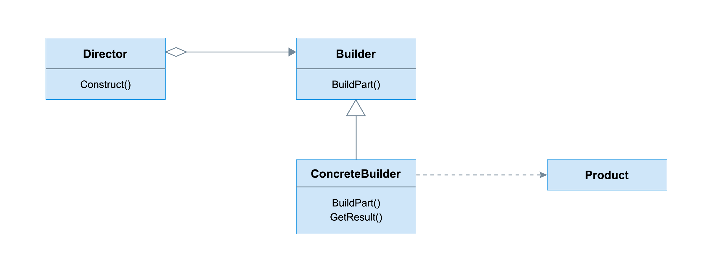
- Directorを付与
```java
class Sandwich{
    private String doughType;
    private String topping1;
    private String topping2;
    private String topping3;
    private String vegetable1;
    private String vegetable2;
    private String vegetable3;
    private String vegetable4;
    private String vegetable5;
    private double sizeCm;
    private boolean cheese;
    private boolean ketchup;
    private boolean mustard;
    private boolean mayonnaise;
    private String sauce;

    public Sandwich(String doughType, double sizeCm, String topping1, String topping2, String topping3, String vegetable1, String vegetable2, String vegetable3, String vegetable4, String vegetable5, boolean cheese, boolean ketchup, boolean mustard, boolean mayonnaise, String sauce){
        this.doughType = doughType;
        this.sizeCm = sizeCm;
        this.topping1 = topping1;
        this.topping2 = topping2;
        this.topping3 = topping3;
        this.vegetable1 = vegetable1;
        this.vegetable2 = vegetable2;
        this.vegetable3 = vegetable3;
        this.vegetable4 = vegetable4;
        this.vegetable5 = vegetable5;
        this.cheese = cheese;
        this.ketchup = ketchup;
        this.mustard = mustard;
        this.mayonnaise = mayonnaise;
        this.sauce = sauce;
    }

    public String toString(){
        String sandwich = this.doughType + " bread, size " + this.sizeCm + "cm with " + this.topping1 + ", ";
        if(this.topping2 != null) sandwich+=this.topping2 + ", ";
        if(this.topping3 != null) sandwich+=this.topping3 + ", ";
        if(this.vegetable1 != null) sandwich+=this.vegetable1 + ", ";
        if(this.vegetable2 != null) sandwich+=this.vegetable2 + ", ";
        if(this.vegetable3 != null) sandwich+=this.vegetable3 + ", ";
        if(this.vegetable4 != null) sandwich+=this.vegetable4 + ", ";
        if(this.cheese) sandwich+="with cheese, ";
        if(this.ketchup) sandwich+="with ketchup, ";
        if(this.mustard) sandwich+="with mustard, ";
        if(this.mayonnaise) sandwich+="with mayonnaise, ";
        if(this.sauce != null) sandwich+="with " + this.sauce;

        return sandwich;
    }
}

class SandwichBuilder{
    private final static String DEFAULT_DOUGH = "Wheat";
    private final static String DEFAULT_TOPPING1 = "Ham";
    private final static double DEFAULT_SIZE_CM = 15.24;

    private String doughType;
    private double sizeCm;
    private String topping1;
    private String topping2;
    private String topping3;
    private String vegetable1;
    private String vegetable2;
    private String vegetable3;
    private String vegetable4;
    private String vegetable5;

    private boolean cheese;
    private boolean ketchup;
    private boolean mustard;
    private boolean mayonnaise;
    private String sauce;

    public SandwichBuilder(){
        this.reset();
    }

    public SandwichBuilder addDoughType(String doughType){
        this.doughType = doughType;
        return this;
    }

    public SandwichBuilder addTopping1(String topping){
        this.topping1 = topping;
        return this;
    }

    public SandwichBuilder addTopping2(String topping){
        this.topping2 = topping;
        return this;
    }

    public SandwichBuilder addTopping3(String topping){
        this.topping3 = topping;
        return this;
    }

    public SandwichBuilder addVegetable1(String vegetable){
        this.vegetable1 = vegetable;
        return this;
    }

    public SandwichBuilder addVegetable2(String vegetable){
        this.vegetable2 = vegetable;
        return this;
    }

    public SandwichBuilder addVegetable3(String vegetable){
        this.vegetable3 = vegetable;
        return this;
    }

    public SandwichBuilder addVegetable4(String vegetable){
        this.vegetable4 = vegetable;
        return this;
    }

    public SandwichBuilder addVegetable5(String vegetable){
        this.vegetable5 = vegetable;
        return this;
    }

    public SandwichBuilder addCheese(){
        this.cheese = true;
        return this;
    }

    public SandwichBuilder noCheese(){
        this.cheese = false;
        return this;
    }

    public SandwichBuilder addKetchup(){
        this.ketchup = true;
        return this;
    }

    public SandwichBuilder noKetchup(){
        this.ketchup = false;
        return this;
    }

    public SandwichBuilder addMustard(){
        this.mustard = true;
        return this;
    }

    public SandwichBuilder noMustard(){
        this.mustard = false;
        return this;
    }

    public SandwichBuilder addMayo(){
        this.mayonnaise = true;
        return this;
    }

    public SandwichBuilder noMayo(){
        this.mayonnaise = false;
        return this;
    }

    public SandwichBuilder addSauce(String sauce){
        this.sauce = sauce;
        return this;
    }

    public SandwichBuilder setSize(double size){
        this.sizeCm = size;
        return this;
    }

    public Sandwich build(){
        Sandwich s = new Sandwich(
            this.doughType, this.sizeCm, this.topping1, this.topping2, this.topping3,
            this.vegetable1, this.vegetable2, this.vegetable3, this.vegetable4,this.vegetable5,
            this.cheese, this.ketchup, this.mustard, this.mayonnaise, this.sauce
        );
        this.reset();
        return s;
    }

    public SandwichBuilder reset(){
        this.doughType = SandwichBuilder.DEFAULT_DOUGH;
        this.sizeCm = SandwichBuilder.DEFAULT_SIZE_CM;
        this.topping1 = SandwichBuilder.DEFAULT_TOPPING1;
        this.topping2 = null;
        this.topping3 = null;
        this.vegetable1 = null;
        this.vegetable2 = null;
        this.vegetable3 = null;
        this.vegetable4 = null;
        this.vegetable5 = null;

        this.cheese = true;
        this.ketchup = false;
        this.mustard = false;
        this.mayonnaise = false;
        this.sauce = null;
        return this;
    }
}

// builderのためのメニュー
enum SandwichMenu{
    CHICKEN_AND_BACON,
    STEAK_AND_CHEESE,
    SPICY_ITALIAN,
    TUNA_AND_EGG,
}

enum SandwichSize{
    FOOTLONG,
    HALF_FOOTLONG,
}

// 全てのdirectorメソッドを持つ、directorクラス
class FairyWorldSandwichDirector{
    public static SandwichBuilder chickenAndBacon(SandwichBuilder builder){
        builder.addDoughType("Italian").addTopping1("Chicken")
                    .addTopping2("Bacon").addSauce("Ranch")
                    .addVegetable1("Lettuce").addVegetable2("Red Onions")
                    .addVegetable3("Tomato").addCheese();
        return builder;
    }

    public static SandwichBuilder steakAndCheese(SandwichBuilder builder){
        builder.addDoughType("Wheat").addTopping1("Steak")
                    .addTopping2("Steak")
                    .addVegetable1("Green Peppers").addVegetable2("Red Onions")
                    .addCheese();
        return builder;
    }

    public static SandwichBuilder spicyItalian(SandwichBuilder builder){
        builder.addDoughType("Wheat").addTopping1("Pepperoni")
                    .addTopping2("Salami")
                    .addVegetable1("Lettuce").addVegetable2("Red Onions").addVegetable3("Tomato").addVegetable4("Cucumbers").addVegetable5("Jalapeno")
                    .addMayo();
        return builder;
    }

    public static SandwichBuilder tunaAndEgg(SandwichBuilder builder){
        builder.addDoughType("Italian Herbs").addTopping1("Tuna")
                    .addTopping2("Eggs")
                    .addVegetable1("Lettuce").addVegetable2("Red Onions")
                    .addMayo();
        return builder;
    }
}

class FairyWorld{
    public Sandwich orderSandwich(SandwichMenu item, SandwichSize itemSize){
        SandwichBuilder sandwichBuilder = new SandwichBuilder();

        // オブジェクトのbuild
        switch(item){
            case CHICKEN_AND_BACON: FairyWorldSandwichDirector.chickenAndBacon(sandwichBuilder); break;
            case STEAK_AND_CHEESE: FairyWorldSandwichDirector.steakAndCheese(sandwichBuilder); break;
            case SPICY_ITALIAN: FairyWorldSandwichDirector.spicyItalian(sandwichBuilder); break;
            case TUNA_AND_EGG: FairyWorldSandwichDirector.tunaAndEgg(sandwichBuilder); break;
        }

        switch(itemSize){
            case FOOTLONG: sandwichBuilder.setSize(15.24);
            case HALF_FOOTLONG: sandwichBuilder.setSize(30.48);
        }

        return sandwichBuilder.build();
    }
}

class Main{
    public static void main(String[] args){
        FairyWorld fairyWorld = new FairyWorld();

        Sandwich chickenAndBacon = fairyWorld.orderSandwich(SandwichMenu.CHICKEN_AND_BACON, SandwichSize.FOOTLONG);

        String endl = System.lineSeparator();
        System.out.println(chickenAndBacon + endl);
        System.out.println(fairyWorld.orderSandwich(SandwichMenu.STEAK_AND_CHEESE, SandwichSize.FOOTLONG) + endl);
        System.out.println(fairyWorld.orderSandwich(SandwichMenu.SPICY_ITALIAN, SandwichSize.HALF_FOOTLONG) + endl);
        System.out.println(fairyWorld.orderSandwich(SandwichMenu.TUNA_AND_EGG, SandwichSize.FOOTLONG) + endl);
    }
}
```

## Prototype
- プログラム実行時にオブジェクトを作成し、それらのオブジェクトを使用して、システム全体で必要なだけ同じオブジェクトを作成するパターン
- キー：識別子、値：オブジェクトのぺアのレジストリが含まれ、各オブジェクトはそれ自身をクローンするclone()メソッドを実装する
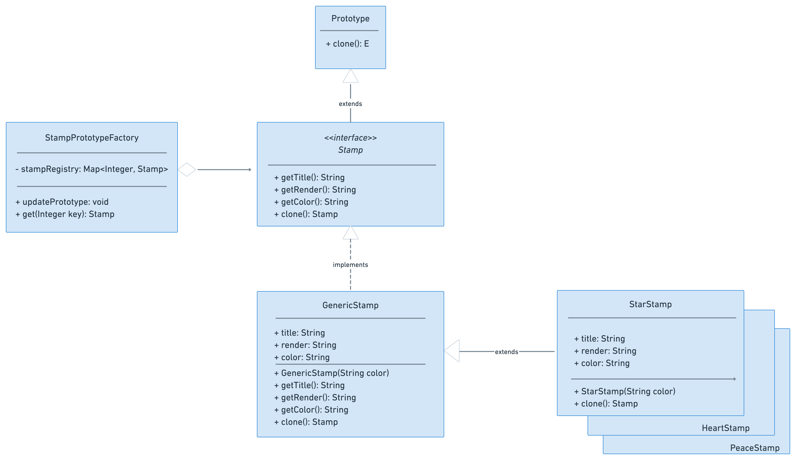
- レジストリを使用することで、与えられた入力に基づいてオブジェクトを作成するFactoryが必要になることに注意
  - 特定のメソッドが呼び出されるのではなく、同じメソッドが与えられたキーで呼び出されるという点をのぞいて、AbstractFactoryと全く同じになる
  - 実行時にFactoryにオブジェクトを動的に追加する機能でもある
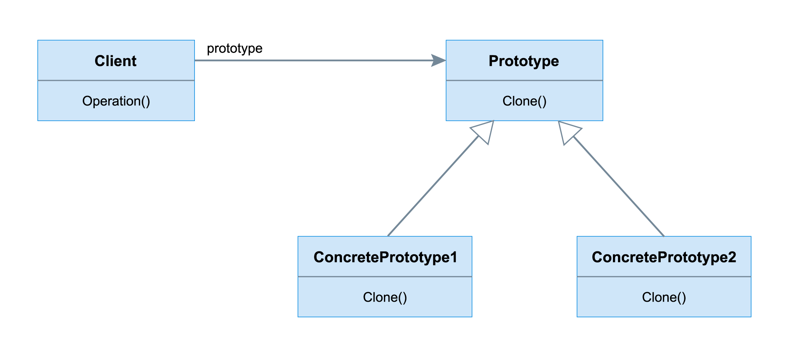
- サブクラスによる拡張性はほとんどなく、クライアントが使うオブジェクトを作成する手順を制御することはほとんどできない
- Factoryのレジストリ内に配置されたオブジェクトをインスタンス化しなければならない


