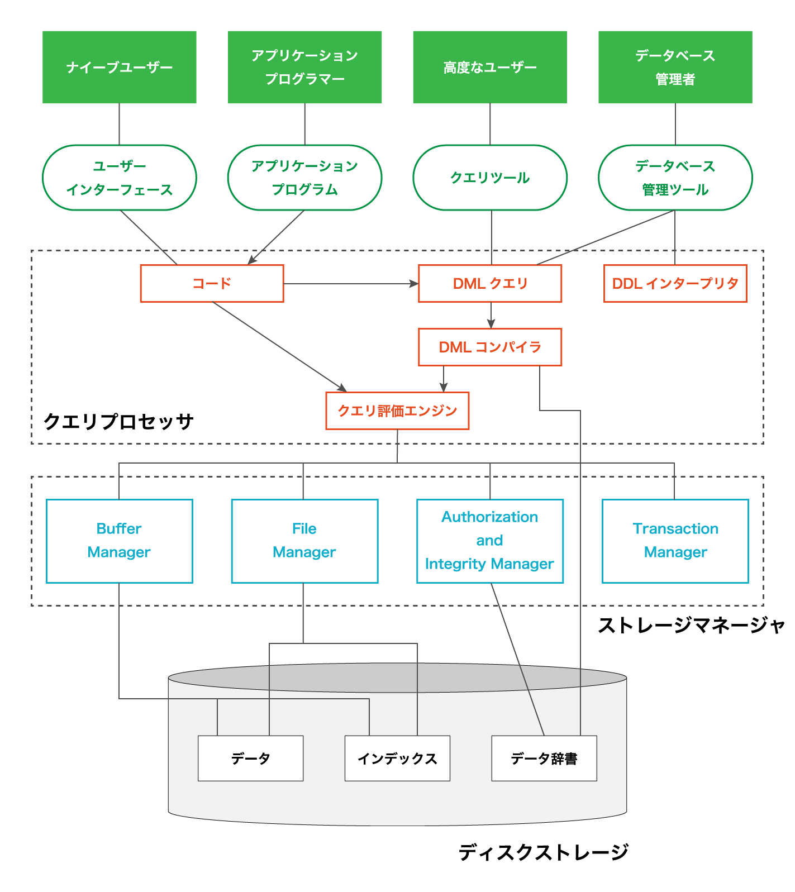
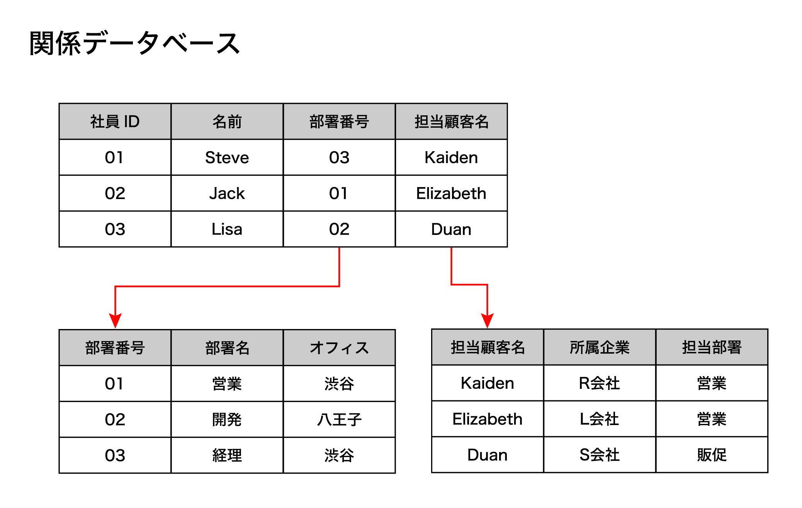
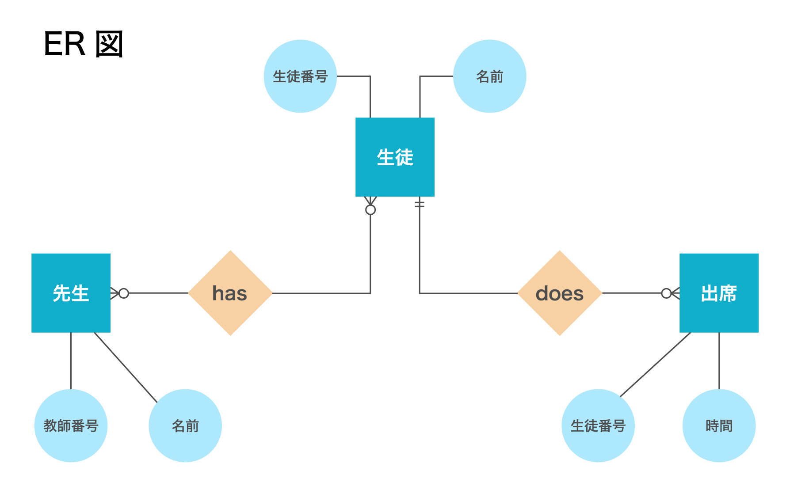
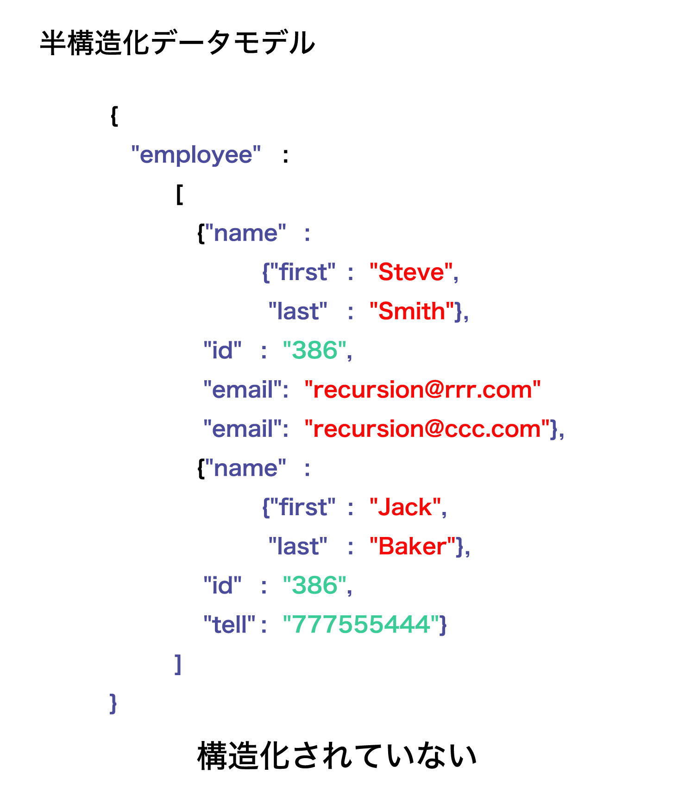
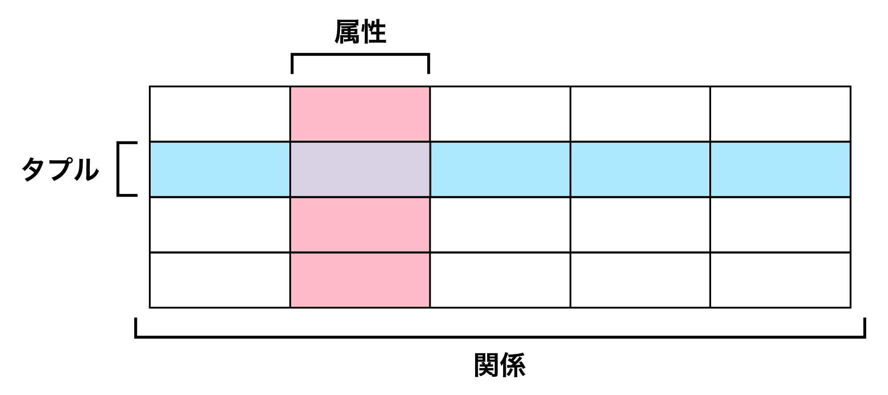

# データベース
- データベースシステムを構成するものについて詳しく学習
- 関係代数とデータベースについて学び、SQLを使ってスキーマを設定し、データを操作
- データベースの効果的な設計方法

## データベースシステム
- コンピュータの CPU はメモリを介して直接動作しますが、メモリはハードウェア的な理由から揮発性（volatile）を持つ。メモリ内のデータを保持するために電力を必要とし、メモリの電源を切ると、メモリ内のデータはすぐに失われる
- データベースは非常に複雑で、膨大な量の作業負荷を処理しています。低・中規模のソフトウェアでは、数十テラバイトのメモリを使用し、1 秒間に何万回もデータにアクセスして更新する
- ソフトウェアエンジニアは、臨機応変に対応できる汎用性の高いストレージシステムを必要とする複雑な構造を扱い、データサイエンティストはソフトウェアが収集したさまざまなデータセットにアクセスして分析を行う
- 大規模なソフトウェアでは数百万人のユーザーを扱うことが多いため、データの保存と取得に対して拡張性を持つ方法が必要となります。その結果、保存されるデータの量と 1 秒間にアクセスされるデータの量は驚異的なものとなり、通常のソフトウェアとは異なる問題や課題が発生する
- データベース管理システム（DBMS : Database Management System）
    - 機能、物理的特性、論理、プロトコルを 1 つのソフトウェアツールに抽象化し、データの保存や読み書きを可能にするシステムのことをデータベース管理システム（DBMS : Database Management System）と呼ぶ

- トランザクション
    - データエントリの更新など、状態の変化を表すデータベースシステム内の作業単位のことを指す

### 利便性 （ease of use）
- データベースシステムを使うと、あらゆるユーザーがデータに簡単にアクセスし更新することができる
- データベースは、開発者がデータを照会 （クエリ） できるように、一連の言語ツールを提供する
- クエリ （query）
    - データを取得したり操作したりするために、データにアクセスするリクエストのことを指す
    - 開発者がアプリケーションを作成した場合、クエリを使うとユーザーが一定量のデータや特定の種類のデータにしかアクセスできないように制限することができる

### 永続性 （durability） 
- 一度コミットされたトランザクションが、システム障害 （コンピュータのシャットダウンなど） が発生しても、コミットされた状態を維持することを意味する
- コンピュータディスクのハードドライブに直接保存するなど、不揮発性を持つストレージによって実現される
- データベースシステムがメインメモリを使用して全てのデータを保存している場合でさえも、システムは常にディスクストレージ内にバックアップを保持する

### 一貫性と統合性 （consistency and integrity） 
- システム内のデータは、特定の情報を参照する異なるセクションが、全て同じデータを参照するように、一貫性を保つ必要がある
- 仮にユーザーが電子メールを更新した場合においても、システム全体で一貫性が保たれ、コピーや参照が全て一致する必要がある
- データエントリは、一貫性を保証するために、制約と呼ばれる指定されたルールに従う必要がある。例えば、ユーザーの給与を数字で入力する必要があるにもかかわらず、文字列が入力された場合、システムが整合性エラーを直ちに認識するべきで、制約条件に従わない場合は、直ちにエラーとなり、トランザクションは実行されるべきではない
- 新しい状態に移行する前に、この新しい状態が有効であることを保証しなければ、以前の有効な状態に戻る

### 冗長性の低減 （reduce redundancy）
- データベースシステムは、データが効率的に整理されているという物理的な特性を持つ
- データベースを慎重に設計することで、相互参照が可能になり、不必要な重複を減らし、データベースのストレージ使用量を低く抑えることができる。冗長性が減ることで、インデックスアルゴリズム等がより強力になり、データへのアクセスをより速く実行することができるようになる

### 独立性と並行性 （isolation and concurrency）
- データベースシステムでは、データを分離・独立させることができます。エントリが入力されると、そのエントリは所定の位置にロックされるか、または　「コミット」 される
- エントリを読み込む際には、データ形式が保証されているので、linux、macOS、windows、その他のプラットフォームから読んでも、システムは同じデータを読み込むことができる
- エントリの更新など、データベースのエントリに対するトランザクションが行われると、それは分離され、完全にコミットされるまで独立して処理される。エントリに対して複数の更新が行われた場合、分離が適用されていれば、更新は全て同時に行われるのではなく、順次処理されているかのように 1 つずつ行われることになる

### 原子性 （Atomicity）
- データベースのトランザクションにおいて、システムの状態を変化させる一連の操作が、全体的に起こるか、あるいは全く起こらないことを意味する
- トランザクションが完全に行われ、状態がコミットされて新しい状態になるか、何も起こらずに以前の正しい状態に戻る、「all-or-nothing」 が適用される

- ACID、すなわち原子性（Atomicity）、一貫性（Consistency）、独立性（Isolation）、永続性（ Durability）は、データベースシステムの基本であり、主要な要素になる

### セキュリティ （security）
- データが非常に貴重なものである以上、データベースシステムにはセキュリティが不可欠です。セキュリティは、意図的かどうかを問わず、データのアクセスや更新に対して行われる安全対策のことを指す
- 認証メカニズムのおかげで、データベースシステム内で異なるアカウントが提供されるので、各データベースユーザーがアクセスできるものをフィルタリングすることができる


## データベースの内部
### クエリプロセッサ（query processor）モジュール
- データベース言語を解釈し、低階層の命令にコンパイルする役割を担っている。データベース言語とは、データベースシステム内で使用可能な、データベースを操作するための言語を指す。ほとんどの関係データベースでは、SQL 言語（structured query language）が採用されている
- データベース言語は、データ定義言語 DDL（data-definition language）、データ操作言語 DML（data-manipulation language）の 2 つの独立したサブ言語から構成されている。SQL のように 1 つの言語で DDL と DML の両方を扱う場合がほとんど。DDL は、データベースのスキーマを定義する役割を担っている。データベースのスキーマ（schema）とは、保存されているデータの集合体に紐付けられる全ての規則のことを指す
- DDLコマンド
    - CREATE args コマンドと DELETE args コマンドがあり、テーブル、ユーザー、ビュー、インデックス、その他多くのアイテムを作成/削除することができる
- DML
    - データベースのユーザーが保存されているデータを追加、アクセス、操作することができます。これは、データの読み取りにつながるクエリ、つまりトランザクションを通じて行われます。他の永続的なストレージと同様に、CRUD の頭文字を使って利用可能な操作を説明する
    - SQL のような言語では、INSERT（作成）、SELECT（読み込み）、UPDATE、DELETE の各コマンドが使われる
```
Create new data （新しいデータの作成）
Read available data （利用可能なデータの読み取り）
Update available data （利用可能なデータの更新）
Delete available data （利用可能なデータの削除）
```

### ストレージマネージャ（storage manager）
- オペレーティングシステムの低階層 I/O API（Input/Output API）と通信することで、データをコンピュータ内のファイルとして保存する役割を果たす
- ストレージマネージャは、データ辞書にアクセスしてデータベース管理者が微調整したデータベースの構造を把握し、整合性と権限のチェックを行うことができる
- ストレージマネージャは、データに素早くアクセスできるルックアップテーブルのように、インデックスのセットを管理することができます。インデックスは通常、平衡二分探索木として実装されます。特に B 木や R 木は、ディスクメモリ効率が良いだけでなく、ルックアップが O（log n）と非常に高速で、O（n）の順序付き走査のような利点を備えている
- データを保存し、CRUD クエリを処理する場合、ストレージマネージャは多くのことを処理しなければなりません。これらの責任は、さらにマネージャ内の他のコンポーネントに委ねられる
```
- Authorization manager
ユーザーがデータにアクセスする権限を持っているかどうかを、データベースのデータ辞書を参照してチェックする

- Integrity manager
状態の変更がスキーマで指定された制約と参照の整合性に従うかどうかをチェックする

- File manager
ディスクストレージ内のデータの構造を決定し、ディスクストレージ内のデータの割り当てを行う

- Buffer manager
メインメモリーに何をキャッシュするかを決定し、ディスクからメインメモリーへのデータの取り込みを行う

- Transaction manager
データベースのトランザクション内で必要な手続きを行います。これには、同時実行時の一貫性の維持、ロールバックの仕組み、原子性のルールの適用等が含まれます。関係データベースでは、ACID （原子性、一貫性、独立性、永続性） ルールが適用される
```
- データベースシステム内では、データは 3 つの異なる階層で抽象化されます。抽象化によって、各階層がそれぞれ独立して存在することができる。つまり、物理層内部の複雑度を理解しなくても、論理層で作業を実行することができる
#### 物理層 （physical level）
データが物理的にどのように保存されるかを決定する。この階層では、次のような質問がある
- データ型は何バイトか？
- ファイル内の記号を解析する際、区切り文字は必要か？
- 使用すべきデータ構造は何か？
- 何をどのような方法でインデックス化するか？

#### 論理層 （logical level）
スキーマ設計のように、データベースが高階層でどのように構成されているかを表す。この階層では、次のような質問がある
- テーブル （データ集） にはどのようなデータ型を束ねるべきか？
- 制約や整合性のルールは何か？
- 他のテーブルのキーなど、参照すべきものはあるか （外部キー等）？
- データベース全体のデータ関係はどうなっているか？

#### 外部層 （view level）
データベースの一部分のみを表す。外部層はデータベース管理者が設定するもので、セキュリティ上の目的や複雑度を軽減するためのもの。アプリケーションの一部や開発者は、大規模なアプリケーションのデータベース設計全体のうち、ごく一部だけを知っていれば問題ない

#### ナイーブユーザー（naive user）
- UIを使って間接的にデータベースシステムとやりとりをするソフトウェアのエンドユーザー
- ユーザーインターフェースは、バックグラウンドで発生する詳細のほとんど全てを隠し、結果のみを表示
- アプリを開いたとき、どのようなデータを表示するかはすでに定義されており、アプリケーションサーバーによって取得される

#### アプリケーションプログラマー（application programmer）
- データベースの開発者は、アプリケーションサーバーにコード化されている全てのビジネスロジックの開発を行い、要件とデータフローに基づいてプログラム内で DML クエリに変換するコードを記述
- ナイーブユーザーがアプリケーションを開いた際に起こる事象、つまり、アプリの手順や条件、オプション等の詳細やビジネスロジックを決定
- データサイエンティストのような開発者は、直接 DML クエリ、データベースツール、その他の分析ソフトウェアを使用して、データベースにあるデータを分析

#### データベース管理者（database administrator）
- データベーススキーマの設定や更新、物理的なストレージ構造の変更、インデックスの定義、データベースユーザーの権限管理、ビューの管理
- バックアップの作成、健康状態のチェック、負荷の管理、古いストレージの交換など、日常的なメンテナンスも行うので、多くのユースケースと高度な技術を持っている傾向にある
- dbeaver、HeidiSQL、MySQL Workbench などの専門的なデータベース管理ツールを使用してデータベースの管理を行う
- DDL を扱う唯一の人間であるため、小規模なチームや専門的なチームでは、アプリケーションプログラマーがスキーマや環境をセットアップするデータベース管理者を兼ねることになる




## データベースモデル
- ソフトウェアを作成する際、要求事項をよく吟味して、高い階層を持つデータモデルを作成することが推奨される
- 機能要件と非機能要件を整理し、システムのデータ要件が適切に作成されることを意味する。つまり、どのようなデータが保存され、どのように処理されるのかを大まかに把握しておけば、ソフトウェアのニーズに合わせてデータベースを作り始めることができる
- データベース設計者は、ソフトウェア設計チームや専門家と直接連携して、ソフトウェアの範囲を事前に十分に把握し、そのニーズに基づいてスキーマを設計する必要がある
- データベーススキーマを設計した後は、データモデルを選択。データモデルは、どのような概念を適用すべきか、また要件をデータベースモデルに適合する設計にどのように変換するかを決定。設計段階では、特定の低階層や物理層のプロパティではなく、まず論理層に焦点を当てることが重要
- データベースシステムの中には、4 つの主要なデータベースモデル


### データベースモデル（database model）
- データベースに共通して適用されるデータモデルで、データの論理構造や、データの整理・保存・操作の方法を決定するもの
- データベースモデルでは、保存されたデータについて特殊な方法で考える必要がる

#### 関係モデル（relational model）
- データと関係をテーブルで表現
- テーブルはリレーションと呼ばれ、データエントリを表すタプルと呼ばれる行と、タプルの要素がどのようなデータタイプであるかを指定する属性と呼ばれる列を含んでいる
- 行のエントリ形式は、テーブル内では常に固定されている

#### 関係データベース（relational database）
- 関係モデルを用いてデータを構造化するデータベースに与えられる名称
- 関係データベースは、最も広く使用されている種類のデータベースで、構造と豊富な機能を備えており、ACID の特徴を保証していることが最大の売りとなる



#### 実体関連データモデル（entity-relationship data model）
- エンティティと呼ばれる基本的なオブジェクトの集合体を使用し、エンティティ間の関係を記述
- ER 図は、現実世界やビジネスの観点からデータを見てオブジェクトを互いに区別し、関係を指定するために使用される
- ER 図を使うと、データベースの設計がしやすくなったり、設計をスキーマへ変換やすくなる



#### 半構造化データモデル（semi-structured data model）
- 同じデータ型のエントリが異なる属性のセットを持つことができるデータモデルのことを指す
- スキーマで指定された固定のカラム（属性）を強制する関係モデルとは異なる
- XML と JSON による表現が最も一般的
- 半構造化データモデルを採用したデータベースでは、key value ペアが重要な役割を果たす。関係データベースではないデータベースは半構造化データモデルに該当し、NoSQL データベースと呼ばれることもある
- これらのデータベースは構造を持たないため、ACID の特徴は保証されない
- 関係データベースと NoSQL データベースの読み取り速度は同じですが、NoSQL データベースの方が書き込み効率が高いため、ACID の特徴を犠牲にしてでも、拡張性の高いソフトウェアに頻繁に使用される傾向にある
- このようなデータベースシステムには、redis、mongodb、cassandra などがある



#### オブジェクトモデル（object model）
- オブジェクト指向プログラミングにおいて、データをオブジェクトになぞらえてモデル化したデータモデルのことを指す
- スキーマがクラスの設計図に近い役割を果たし、データエントリはある時点でのオブジェクトの状態であることを意味する
- データエントリを読み込んでプログラミング言語にロードすることで、オブジェクトを再作成することができる
- オブジェクトモデルのデータには、関係データベースが最も一般的に使用されますが、オブジェクトモデルのニーズを満たす特定のデータベースもある
- ORM（Object Relational Mapping）のように、データベースのエントリをマッピングし、実行時のオブジェクトに変換するツールもある


## 関係モデル
- 関係データベース（relational database）は、商用ソフトウェアの中で最もよく使われるデータベースシステム
- データベースが関係モデル（relational model）を採用している場合、システムの内部は、論理層や外部層のような高い階層とは完全に独立
- 関係代数（relational algebra）
    - 関係と呼ばれるデータの集合を定義し、関係を入出力とする関数を定義する数学理論のこと
    - 関係を入力として取り込み、述語と一定の操作を行うことによって、関係を変換することができる


### テーブル（table）
同じサイズのタプルの集合であり、タプル内の各位置は属性によって定義される

### タプル（tuple）
- 固定サイズのデータのリストを指す。タプルは通常、n-タプルと呼ばれ、n はリストの長さを表す。同じデータ型のエントリが要求される固定サイズの配列とは異なり、タプルの要素は必ずしも同じデータ型である必要はない
- データエントリやテーブルの行（row）と呼ばれる

### 属性（attribute）
- タプル内の位置を特定するもので、データ型や定義域などのプロパティを定義する
- 定義域（domain）とは、許容される値の集合を指し、例えば、unsigned intsの定義域は、全ての正の整数になる
- 属性はタプルのインデックスやテーブルの列（column）と呼ばれる

## 参照関係
- キーを使うことで、関係内のデータにアクセスしたり、他の関係のデータを参照することができる
- キー（key）
    - 関係の中で、キー（key）とは、関係内のタプルを一意に識別するために使用される、属性または属性の集合のことを指す
- スーパーキー（super key）
    - スーパーキー（super key）とは、関係内でタプルを一意に識別することができる任意のキー
- 候補キー（candidate key）
    - 属性が一つでも欠けると一意に識別できなくなる属性の集合
    - 1 つの関係は複数の候補キーを持つことができる
    - users 関係では、[username]と [email] によってタプルを識別することができるため、[username]と [email] は候補キーとなる
- 主キー（primary key）
    - タプルの識別に最も好ましいものとして、設計者や開発者にとって選択される候補キー
    - 関係に存在する候補キーが 1 つしかない場合、その候補キーは主キーとなる
    - users 関係の例では、[username] か [email] かを主キーとして選択する必要があります。選択された主キーは、ユーザーを識別して参照するための手段となる。ユーザーX の主キーがあれば、ユーザーX に関する全ての情報を得ることができる
- 一般的にデータベース設計者は任意の属性として id 属性を割り当てる。id はほとんどの場合、0 を除く正の整数として設定されるため、要素にアクセスするための配列のインデックスとして使うことができる。この id 属性は主キーとしても使用される。
- 候補キーに含まれない全ての属性は、非キー属性（non-key attribute）と呼ばれる

- 外部キー（foreign key）
    - 関係 R1 の属性 A の集合であり、関係 R2 の主キーを指す。つまり、R1 の外部キー A は、主キー B を持つ R2 のタプルを参照する。
- 中間テーブル（intermediate table）
    -  2 つのテーブルの間に存在する、それぞれに接続するテーブル
